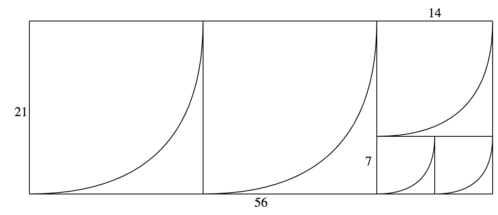

# ユークリッドの互除法（Euclidean algorithm）

ある2つの自然数 $$a,b$$ の最小公倍数を求めるためのアルゴリズム。
すなわち $$ax + by = 0$$ となる整数 $$x,y$$ を求めることができる。

また $$ax + by = \gcd(a,b)$$ となる整数 $$x,y$$ を求める**拡張ユークリッドの互除法（extended Euclidean algorithm）**も存在する。

## 手順

1. 大きい方の値を小さい方の値で割ったときの剰余を取る
2. 剰余が0なら小さい方の値が最小公倍数である
3. 剰余が0でないなら小さい方の値と剰余に関して上の手順を繰り返す

図的に表現するとこのようになる（21と56の最小公倍数は7）。



2ステップで大きい方の値が半分以下になることが保証されるため、大まかな時間計算量は $$O(\log \max(a,b))$$ になる。

## 実装例

`x < y`でも1回目の呼び出しで入れ替えが行われるので、呼び出し時に大小は気にしなくて良い。

```rust
fn gcd(a: usize, b: usize) -> usize {
    if (b == 0) { a } else { gcd(b, a % b) }
}

fn main() {
    let x = 21;
    let y = 56;
    println!("gcd({}, {}) = {}", x, y, gcd(x, y));
}
```
