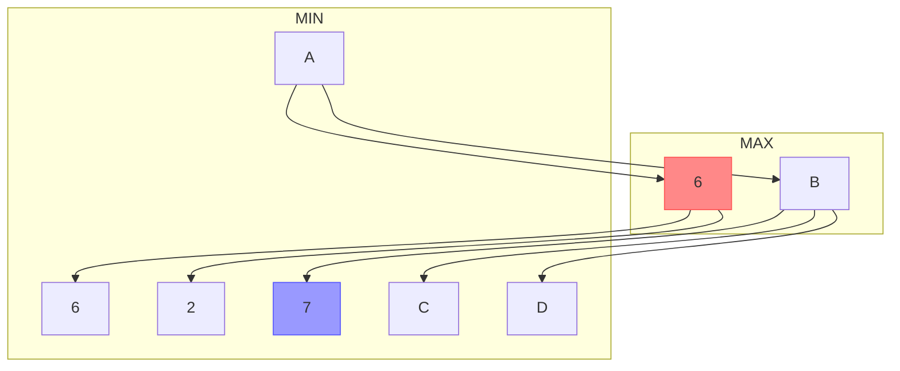

# ゲーム木の探索

## ゲーム木とは

組み合わせゲーム理論（チェスや囲碁のような展開型（逐次手番の）確定完全情報ゲームを題材とした理論）で扱う問題を[状態空間表現](state_space.md)で示したものを**ゲーム木**という。
特に起こりうるすべての盤面を含むものを完全ゲーム木、そうでないものを部分ゲーム木と呼ぶ。

## ミニマックス法

ゲーム理論における戦略の1つ。
ミニマックスとは、想定される最大の損害を最小化するように手を選択する、という意味。

ゲーム木を対象としたミニマックス法では以下のような手順で探索を行う。

1. あらかじめ決められた深さにあるすべてのノードの評価値（自分がどの程度有利な状況か）を計算する
2. 末端から順に、以下の法則に従って１つ上の層のノードの評価値を再帰的に決めていく
    * $$n-1$$ 層目のあるノードが「自分が打つ前の状態」なら、繋がっている $$n$$ 層目のノードの評価値の最大値をそのノードの評価値とする（このときの $$n-1$$ 層目のノードを**MAX節点**という）
    * $$n-1$$ 層目のあるノードが「相手が打つ前の状態」なら、繋がっている $$n$$ 層目のノードの評価値の最小値をそのノードの評価値とする（このときの $$n-1$$ 層目のノードを**MIN節点**という）
3. 根（現在の状態）の1つ下の層のノード（次の手を打った状態）のうち評価値が最も高いものを選択する

つまり自他共に最善手を打つことを想定してゲームの展開を読む手法である。
末端のノードの評価値が適当で、プレイヤーが互いに最善手を打つならば、このアルゴリズムで求めたものが最善手となる。

しかし探索を深くするほどノードの数が指数関数的に増えるため、選択肢の多いゲームでは読める深さに限界がある。

## アルファ・ベータ法（alpha-beta pruning）

ミニマックス法の評価を枝刈りによって高速化した手法。

### $$\mathrm{\alpha}$$ カット

下の図は左下のノードから順に評価値を決めていく途中の図である。
いま A の評価値を求めるために孫ノードの1つ（青色）の評価値を得たところであるとする。

ミニマックス法に従えば C,D,B,A を順に評価するところだが、B はMIN節点であるため B の評価値は $$1$$ 以下になることがこの時点でわかる。
また $$2 > 1$$ であるため、A の評価値が $$2$$ であることが確定する。

このように`MAX-MIN-MAX`の並びの中で、最下層の一部の評価を省略することを**$$\mathrm{\alpha}$$ カット**という。

### $$\mathrm{\beta}$$ カット

$$\mathrm{\alpha}$$ カット同様に次のような図について考える。

ここでも B の評価値が $$7$$ 以上になることがわかる。
また $$6 < 7$$ であるため A の評価値が $$6$$ であることが確定する。

このように`MIN-MAX-MIN`の並びの中で、最下層の一部の評価を省略することを**$$\mathrm{\beta}$$ カット**という。

## AND/OR木によるミニマックス法

二人で対戦する打ち手の選択肢が有限である組み合わせゲーム（二人零和有限確定完全情報ゲーム）の完全ゲーム木のミニマックス法はAND/OR木の探索問題に帰着する。

すなわち、勝利を`True`、敗北を`False`とし、自分の手番を**OR節点**、相手の手番を**AND節点**としたAND/OR木で最善手を決定できる。
