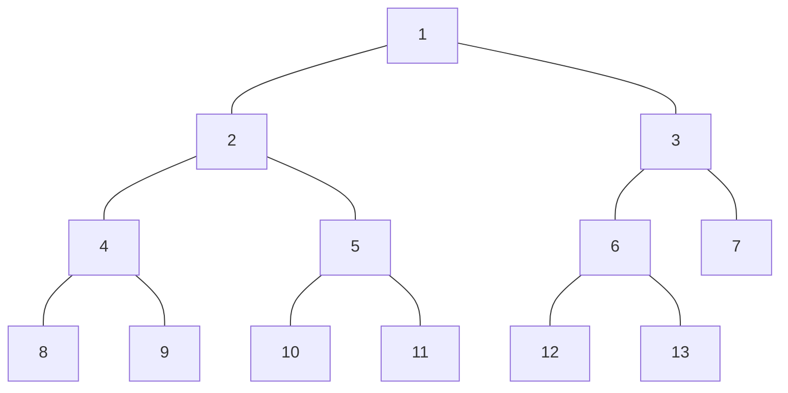

# ヒープ・プライオリティキュー

**ヒープ** は「親ノードの値 $$\geq$$（もしくは$$\leq$$）子ノードの値」を満たす、半順序関係を実現した木構造を指す。
二分木で実装されたヒープを特に二分ヒープと呼ぶ。

**プライオリティキュー** は蓄えた値のうち最大（最小）のものをpopするデータ構造を指す。
プライオリティキューはヒープによって実装可能である。

* ヒープの探索の時間計算量は木の深さに比例する
  * 平均時間計算量は$$O(\log n)$$

## 二分ヒープの原理

半順序木はインデックスの割り振り方を工夫することで1つの配列の上に木構造を展開できる。

計算の都合からインデックスを1始まりとする。
木構造の各ノードに下の図のようにインデックスを割り振ることにする（要素13個が格納されているヒープの例）。



すると、あるノード $$i$$ の子ノードは $$2i$$, $$2i+1$$、親ノードは $$\mathrm{floor}(i/2)$$ となるため、ノードを辿る作業が簡単に行える。

### 最小値の取り出し

ヒープの`pop`は次のように実装できる。

1. 根のノードの値を取り出す（これが最小値）
2. 代わりに一番インデックスが大きいノードの値 $$p$$ を根に格納する
3. $$p$$ より小さな値を持つ子ノードがあれば、最も小さい値を持つノードと値を交換する
4. 3を繰り返す

### 値の挿入

ヒープの`push`は次のように実装できる。

1. 配列の最後尾に新しい値 $$p$$ を挿入する
2. 親ノードの値が $$p$$ より大きければ値を交換する
3. 3を繰り返す

## 実装

C++の場合は標準ライブラリの`queue`に`priority_queue<T>`が用意されている。

## プライオリティキューを用いて解ける問題の例

```
ガソリンは距離1に対して1消費する、ガソリンタンク容量が無制限のトラックにガソリンがPだけ積まれている。
このトラックで距離Lの道を移動する。
道の途中には距離A_iの地点にB_iのガソリンを持ったガソリンスタンドがある。
トラックは移動を燃料切れせず移動を完了できるか？また最小で何回の給油が必要か？
```

この問題は次の手順で解くことができる。

1. 次のガソリンスタンドに移動できるか判定する。
   * 移動できた場合、そこで給油できるガソリン量をプライオリティキューにpushする。
   * 移動できない場合、プライオリティキューからこれまで通過したガソリンスタンドのうちガソリン量の最も多いものをpopし、そこで給油していたことにする。
2. 上記の手順を繰り返す。

## 実装例

```cpp
#include <iostream>
#include <queue>

using namespace std;

int main(void) {
  int n = 4, l = 25, p = 10;
  //簡単にするためゴールもガソリンスタンドのリストに追加する
  int stations[][2] = {{10, 10}, {14, 5}, {20, 2}, {21, 4}, {25, 0}};

  //--------------------

  priority_queue<int> pq;
  int curpos = 0, ans = 0, tank = p;

  for (int i = 0; i < n + 1; i++) {
    int d = stations[i][0] - curpos;
    while (tank - d < 0) {
      if (pq.empty()) {
        cout << "-1" << endl;
        return 0;
      }
      tank += pq.top();
      pq.pop();
      ans++;
    }
    tank -= d;
    curpos = stations[i][0];
    pq.push(stations[i][1]);
  }

  cout << ans << endl;

  return 0;
}
```
