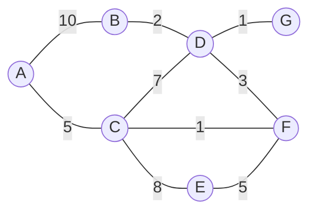

# 最小木問題（mininmum spanning tree）

無向グラフの中で枝のコストの和が最小になる全域木を見つける問題を最小木問題という。
詳細は[グラフ理論>最小木問題](../../mathematical_programming/graph_theory/minimum_spanning_tree_problem.md)へ。

以下に最小木問題を解くためのアルゴリズムを示す。
頂点数 $$|V| = n$$、辺の数 $$|E| = m$$ とする。

## 解ける問題の例

都市の間を結ぶ道路を建設したい。
しかし建設費に限りがあるため、とりあえずはすべての都市を結べるような建設費が最小の道を建設したい。
建設可能な道とそのコストは以下の通りである。



## Prim法

Prim法はある頂点を始点に木から一番近い頂点を吸収する形で木を成長させていく手法。

1. 任意の1頂点 $$r$$ を指定し、$$U := \{r\}, \ F:=\emptyset$$ とする
2. $$U=V$$ なら終了する、そうでなければ続行する
3. $$\min \{ w(e) \ | \ e = (u,v) \in E, \ u \in U, \ v \in V \backslash U \}$$ となる辺 $$e'=(u',v')$$ を選択し、$$F:=F\cup\{e'\}, \ U:= U \cup \{v'\}$$ とする
4. 2~3を繰り返す

時間計算量は $$O(n^2)$$ だが、各頂点の情報をフィボナッチヒープに格納すれば $$O(m + n \log n)$$ となる。

```rust
use std::cmp::Ordering;
use std::collections::BinaryHeap;

#[derive(Clone, Eq, PartialEq)]
struct Edge {
    v1: usize,
    v2: usize,
    cost: isize,
}

impl Ord for Edge {
    fn cmp(&self, other: &Edge) -> Ordering {
        other.cost.cmp(&self.cost)
    }
}

impl PartialOrd for Edge {
    fn partial_cmp(&self, other: &Edge) -> Option<Ordering> {
        Some(self.cmp(other))
    }
}

struct Graph {
    vert_count: usize,
    edges: Vec<Edge>,
}

fn prim(graph: &Graph) -> Result<Vec<Edge>, &str> {
    let mut edge_table: Vec<Vec<isize>> = (0..graph.vert_count)
        .map(|_| (0..graph.vert_count).map(|_| -1).collect())
        .collect();

    for e in graph.edges.iter() {
        edge_table[e.v1][e.v2] = e.cost;
        edge_table[e.v2][e.v1] = e.cost;
    }

    let mut used_verts: Vec<bool> = (0..graph.vert_count).map(|_| false).collect();
    used_verts[0] = true;

    let mut used_edges: Vec<Edge> = Vec::new();

    let mut min_heap = BinaryHeap::<Edge>::new();
    for (i, c) in edge_table[0].iter().enumerate() {
        if c != &-1 {
            min_heap.push(Edge { v1: 0, v2: i, cost: c.clone() });
        }
    }

    let mut used_verts_count = 1;
    while used_verts_count < graph.vert_count {
        match min_heap.pop() {
            Some(Edge { v1, v2, cost }) => {
                if used_verts[v1] && used_verts[v2] {
                    continue;
                } else {
                    let i = if used_verts[v1] { v2 } else { v1 };
                    used_verts[i] = true;
                    used_verts_count += 1;
                    used_edges.push(Edge { v1, v2, cost });
                    for (j, c) in edge_table[i].iter().enumerate() {
                        if c != &-1 {
                            min_heap.push(Edge { v1: i, v2: j, cost: c.clone() });
                        }
                    }
                }
            }
            None => {
                return Err("this is a disconnected graph");
            }
        }
    }

    Ok(used_edges)
}

fn main() {
    let mut edges = Vec::new();
    edges.push(Edge { v1: 0, v2: 1, cost: 10 });
    edges.push(Edge { v1: 0, v2: 2, cost: 5 });
    edges.push(Edge { v1: 1, v2: 3, cost: 2 });
    edges.push(Edge { v1: 2, v2: 3, cost: 7 });
    edges.push(Edge { v1: 2, v2: 4, cost: 8 });
    edges.push(Edge { v1: 2, v2: 5, cost: 1 });
    edges.push(Edge { v1: 4, v2: 5, cost: 5 });
    edges.push(Edge { v1: 3, v2: 5, cost: 3 });
    edges.push(Edge { v1: 3, v2: 6, cost: 1 });

    let graph = Graph { vert_count: 7, edges };

    let res = prim(&graph);

    match res {
        Ok(edges) => {
            for e in edges.iter() {
                println!("{} - {} \tcost:{}", e.v1, e.v2, e.cost);
            }
        }
        Err(m) => println!("{}", m),
    }
}
```

```
0 - 2 	cost:5
2 - 5 	cost:1
5 - 3 	cost:3
3 - 6 	cost:1
3 - 1 	cost:2
5 - 4 	cost:5
```

## Kruskal法

Kruskal法は重みの小さい辺を順に走査し、森を成長させていく手法。

1. $$F:= \emptyset, \ i:= 1$$ とし、辺を重みの小さい順にソートする（$$e_1, e_2, \cdots$$）
2. $$|F| = n-1$$ なら終了する、そうでなければ続行する
3. $$F \cup \{a_i\}$$ が閉路を含まないなら $$F := F\cup \{a_i\}$$ とする
4. $$i:=i+1$$ とする
5. 2~4を繰り返す

ソートの時間計算量は $$O(m \log m)$$ であり、メインループは $$O(nm)$$ になる。
