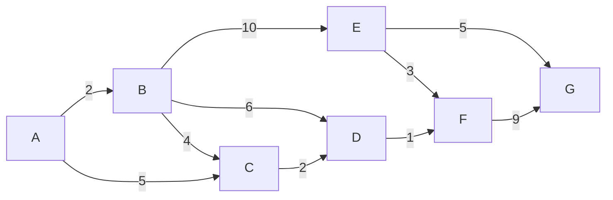

# 最短経路問題

## ベルマンフォード法

重み付き有向グラフの単一始点最短経路問題を解くための手法。

特徴としては

* 負の重み付けがあっても対応できる
  * ただし、負の閉路がある場合はそもそも最短経路が定まらないため解けない。負の閉路の検出は可能。
* 計算量は$$O(|V|\cdot |E|)$$

始点$$s$$から頂点$$i$$への最短距離$$d[i]$$を動的計画法を用いて計算していく手法。

<center>
$$
d[i] = min\{d[j]+c_{ji}|e=(i,j)\in E\}
$$
</center>

$$d[i]=INF$$を初期値として利用する。

負の閉路がない限り、$$d[i]$$の更新は高々$$|V|-1$$回しか行われないため、検証のアルゴリズムは最大でも$$(|V|-1)\cdot |E|$$回しか実行されない。

そのため、この回数を超えてループが実行されていればグラフに負の回路が存在することがわかる。



### 実装例

```cpp
#include <iostream>

using namespace std;

struct edge {
  int from, to, cost;
};

const int INF = 100000;
const int MAX_E = 10, MAX_V = 7;

edge es[MAX_E] = {{0, 1, 2}, {1, 2, 4}, {0, 2, 5}, {1, 4, 10}, {1, 3, 6},
                  {2, 3, 2}, {4, 5, 3}, {3, 5, 1}, {4, 6, 5},  {5, 6, 9}};
int d[MAX_V];

void shortest_path(int s) {
  for (int i = 0; i < MAX_V; i++)
    d[i] = INF;
  d[s] = 0;

  while (true) {
    bool updated = false;
    for (int i = 0; i < MAX_E; i++) {
      edge e = es[i];
      if (d[e.from] != INF && d[e.to] > d[e.from] + e.cost) {
        d[e.to] = d[e.from] + e.cost;
        updated = true;
      }
    }
    if (!updated)
      break;
  }
}

int main(void) {
  shortest_path(0);
  for (int i = 0; i < MAX_V; i++)
    cout << d[i] << endl;
  return 0;
}
```
