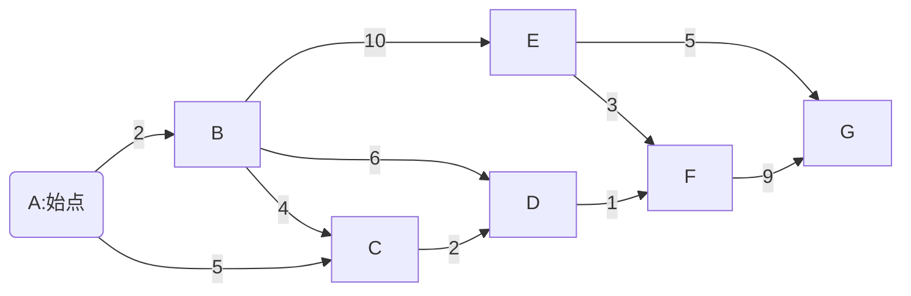

# 単一始点最短経路問題

## 問題の特徴

* 始点から各頂点への最短距離を求める
* 「"最短距離が確定している頂点"に隣接する頂点の最短距離を再計算する」を繰り返せば全ての点への最短距離が求まる。
* 負の閉路がある場合は最短距離が定まらないため解けない

## ベルマンフォード（Bellman-Ford）法

重み付きグラフの単一始点最短経路問題を解くための手法。

次のような特徴がある。

* 負の重み付けがあっても対応できる
* 負の閉路の検出が可能
* 隣接行列を用いたときの計算量は $$O(|V|^3)$$
* 隣接リストを用いたときの計算量は $$O(|V|\cdot |E|)$$

### 手法

1. 頂点 $$i$$ までのその時点での最短距離を $$d[i]$$ に格納するものとする。

1. 以下の式を全ての頂点に対して繰り返し実行し、すべての $$d[i]$$ が更新されなくなったら計算が完了したものとする。ただし $$d[s] = 0$$（始点）, $$d[i]=INF$$ を初期値として利用する。

$$
d[i] = \min\{d[j]+c_{ji}\ |\ e=(i,j)\in E\}
$$

全ての頂点に対して繰り返し実行するのは、グラフが負の重み付けを持つ場合、最短距離が確定しているかの判断ができないため。

### 負の閉路の判定

負の閉路がない限り、$$d[i]$$ の更新は高々 $$|V|-1$$ 回しか行われないため、検証のアルゴリズムは最大でも $$(|V|-1)\cdot |E|$$ 回しか実行されない。

そのため、この回数を超えてループが実行されていればグラフに負の回路が存在することがわかる。

### 問題例

有向グラフ



### 実装例

有向グラフを隣接リストで管理する場合。

無向グラフを検証する場合は逆向きの要素を隣接リストに追加する。

```cpp
#include <iostream>

using namespace std;

struct edge {
  int from, to, cost;
};

const int INF = 100000;
const int MAX_E = 10, MAX_V = 7;

edge es[MAX_E] = {{0, 1, 2}, {1, 2, 4}, {0, 2, 5}, {1, 4, 10}, {1, 3, 6},
                  {2, 3, 2}, {4, 5, 3}, {3, 5, 1}, {4, 6, 5},  {5, 6, 9}};
int d[MAX_V];

void shortest_path(int s) {
  for (int i = 0; i < MAX_V; i++)
    d[i] = INF;
  d[s] = 0;

  while (true) {
    bool updated = false;
    for (int i = 0; i < MAX_E; i++) {
      edge e = es[i];
      if (d[e.from] != INF && d[e.to] > d[e.from] + e.cost) {
        d[e.to] = d[e.from] + e.cost;
        updated = true;
      }
    }
    if (!updated)
      break;
  }
}

int main(void) {
  shortest_path(0);
  for (int i = 0; i < MAX_V; i++)
    cout << d[i] << endl;
  return 0;
}
```

## ダイクストラ（Dijkstra）法

非負の重み付きグラフの単一始点最短経路問題を解くための手法。

次のような特徴がある。

* 隣接行列を用いたときの計算量は $$O(|V|^2)$$
* プライオリティーキューを用いたときの計算量は $$O(|E|\log |V|)$$

### 手法

重み付けが非負である場合、「未検証の頂点のうち最も $$d[i]$$ が小さいものから順に隣接する頂点の最短距離を再計算する」を繰り返せば、最も $$d[i]$$ が小さい頂点は最短距離が確定していることが帰納的に保証されるため、全ての頂点について最短距離が求まる。

```cpp

```
