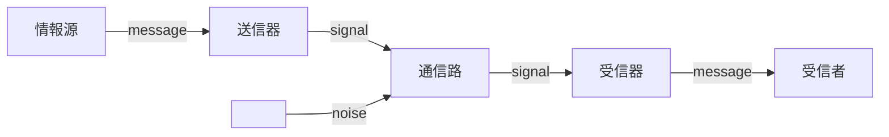

# 情報理論

情報理論は情報分野におけるデータ容量の削減・通信の速度と確度の向上などの課題を数学的な手法に則って議論する分野。
1948年にA.Shannonが提唱した情報源符号化理論が起源とされる。

## シャノンの情報理論

シャノンの情報理論では通信を上のようにモデル化する（シャノンの通信モデル）。

まず**情報源（information source）**から発生する**通報（message）**を送信器（transmitter）で**符号化（coding）**し信号（signal）として送り出す。
送り出された信号はノイズの影響を受ける**通信路（channel）**を通り、受信器（receiver）で**復号（decoding）**したものを受信者が受け取る。

シャノンの情報理論では値と時間軸を離散化した**ディジタル情報源**を仮定し、情報源から生じる通報を記号化したものを**情報源記号**と呼ぶ。

符号化によって得られるものを**符号語**という。
符号語を構成する記号は**符号アルファベット**と呼ばれる。
現代の計算機では実質`0`/`1`を符号アルファベットとする2ビット表現に置き換えることを符号化と呼んでいる。

情報源から生じる通報と受信者が受け取る通報は有限個の候補のいずれかが生じるという側面から一種の[確率変数](../../mathematics/statistics/random_variable.md)であるといえる。

シャノンは、確率の知識を利用して通報が持つ**情報量**を定義し、通信路や符号化手法の効率を数学的に論じた。
