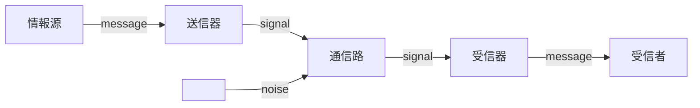

# 符号化

情報源を $$n$$ 元符号に符号化した際の符号の性質について考える。

復習：[シャノンの通信モデル](shannon1.md#シャノンの通信モデル)

## 一意な復号可能性

情報源と符号語が1対1に結びついているような符号を**一意に復号可能**な符号という。

>例：一意に復号不可能な符号

>$$s_1$$ : `0`, $$s_2$$ : `00`, $$s_3$$ : `1` 

>ブロック`001`を受信しても、$$\{s_1,s_1,s_3\}$$と$$\{s_2,s_3\}$$の区別がつかない。

## 瞬時復号可能性

各符号語の最後尾の符号アルファベットを受信した時点で復号先が一意に決まるような符号を**瞬時復号可能**な符号という。

瞬時復号可能であるかは、枝に符号アルファベットを割り振った $$n$$ 分木を描き、すべての情報源記号が葉ノードに位置するか確認することで判別できる。

瞬時に復号可能であるということは、受信した信号のバッファの使用量と判別アルゴリズムを最小限にできるということであり、実用上重要な概念である。

>例：瞬時復号不可能な符号

>$$s_1$$ : `0`、$$s_2$$ : `01`、$$s_3$$ : `011`、$$s_4$$ : `0111`

>`01110`を1ビットずつ受信した場合、`0`（$$s_1$$,$$s_2$$,$$s_3$$,$$s_4$$）、`01`（$$s_2$$,$$s_3$$,$$s_4$$）、`011`（$$s_3$$,$$s_4$$）、`0111`（$$s_3$$,$$s_4$$）、`01110`（$$s_4$$ 確定）と4ビット分のバッファが必要になる上、判別の効率が悪い。

## クラフトの不等式（Kraft's inequality）

各符号語の長さが $$l_i \ \ (i=1,\cdots,n)$$ となる $$r$$ 元符号について、

瞬時復号可能である　⇔　$$\sum_{i=1}^n r^{-l_i}\leq 1$$

またこの不等式は一意に復号可能な符号が存在するための必要条件でもあることがマクミラン（B.McMillan）によって証明された。

## 情報源符号化定理（source coding theorem / noiseless coding theorem）

シャノンの第一基本定理とも。

情報源は次式を満たす平均符号長 $$L$$ の $$n$$ 元符号に符号化できる。

$$
H(S)=-\sum_{A_i \in \Omega}P(A_i)\log_n P(A_i) \leq L
$$

すなわち情報源を符号化する際、平均符号長は底を $$n$$ としたときの平均情報量より長くなることを示している。

逆に言えば、シャノンの情報量（エントロピー）は「情報源を $$n$$ 元符号に符号化したときの最短の平均符号長」を情報量として捉えたものである。

## 符号の効率・冗長度

情報源符号化定理により最良の平均符号長は $$H(S)$$ となる（実際は天井関数をかけたものになるがここでは無視する）ことを利用して、ある符号がどの程度効率的であるかを評価できる。

ある符号の平均符号長が $$L$$ であるとき、$$\eta = H(s)/L$$ を符号の**効率**、$$r=1-\eta=(L-H(s))/L$$ を符号の**冗長度**と呼ぶ。
