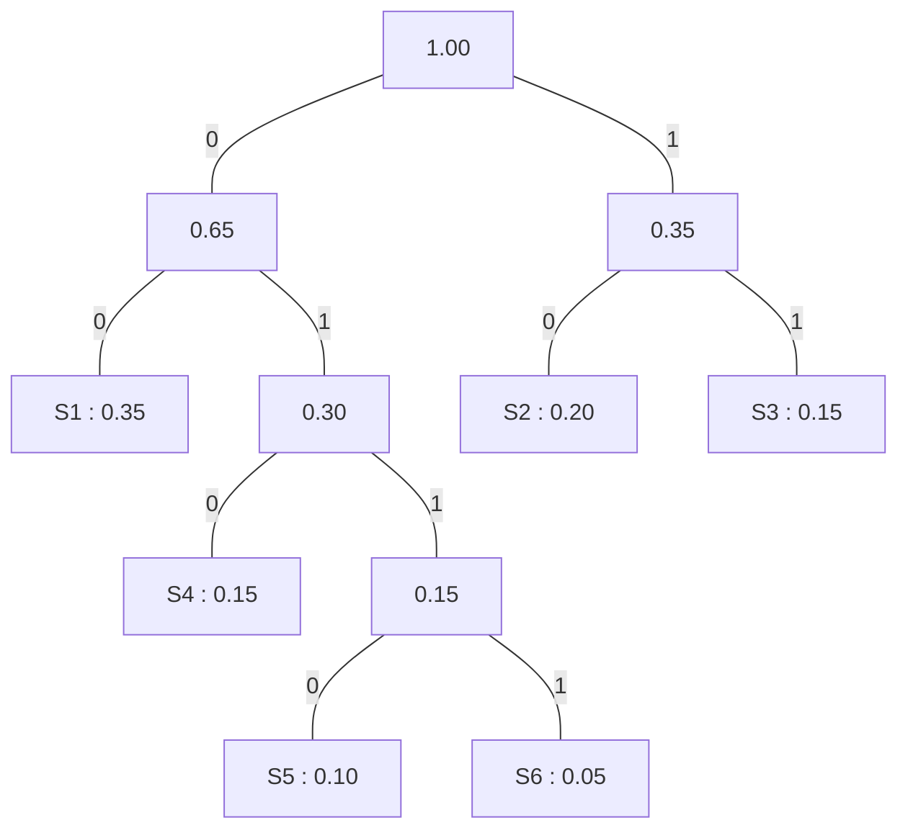

# ハフマン符号化（Huffman coding）

ハフマン符号化とは、1952年にA.Huffmanによって提案された、コンパクト符号を作成する手法を指す。

>コンパクト符号（compact code）

>ある情報源記号とそれぞれの生起確率が与えられたとき、[情報源符号化定理](coding.md#情報源符号化定理（source-coding-theorem--noiseless-coding-theorem）)に基づいて平均符号長が最小になるように符号化したもの。可逆圧縮かつ記号と符号を1対1に紐付ける符号化としては最良のものを指す。

## 手順

情報源記号を $$n$$ 進数に符号化することを考える。

ハフマン符号化では以下の手順に従って、枝に1桁の符号、葉ノードに情報源記号を持つ木を構築する。

1. 情報源記号をそれぞれ1つの木とする
2. 根の中から生起確率の小さいものを $$n$$ 個選び、それらの生起確率の和を値とする親ノードを追加する
3. 2の手順を繰り返し、全体が1つの木になったら終了する

## 例

6つの情報源記号を2進数に符号化する。

|情報源記号|符号|
|----|----|
|S1|`00`|
|S2|`10`|
|S3|`11`|
|S4|`010`|
|S5|`0110`|
|S6|`0111`|
