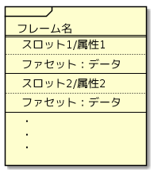

# フレーム（frame）

1975年にM.Minskyによって提案された、典型的知識・階層的知識・事象に付随する手続き的知識を表現するためのデータ構造。

## 構造

フレームは以下の要素からなる。
なお、これらの呼び方は設計・実装によって微妙に異なることがある。

* フレーム名
* スロット／属性
* ファセット（属性自体の性質を示すもの）
  * 値
  * 暗黙値（継承先で特に上書きされなかったとき暗黙的に利用する値）
  * IF-NEEDED（必要ならデータとして格納された処理を実行する）
  * IF-ADDED（データとして処理が格納されていればそれを実行する）　　etc...
* データ
  * 値・処理・他のフレームなど

またフレームは継承の概念（is-a関係）を持っており、あるフレームを親としてそれを継承する子フレームを定義できる。
