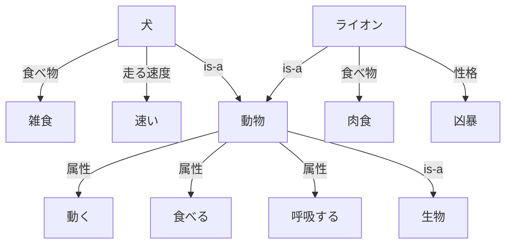

# 意味ネットワーク（semantic network）

概念の間の意味関係を表現する知識表現手法。

[プロダクションシステム](production_system.md)や[フレーム](frame.md)より単純な構造をしており、表現力が高い。
しかし、概念形成の処理が複雑になる、工夫しなければ探索空間が無限に広がるなどの問題点がある。

## 構成要素

* 頂点
  * 概念を表す
* 辺・枝
  * 概念の間の関係を表す
* 辺のラベル
  * 関係の意味を表す

## 例

