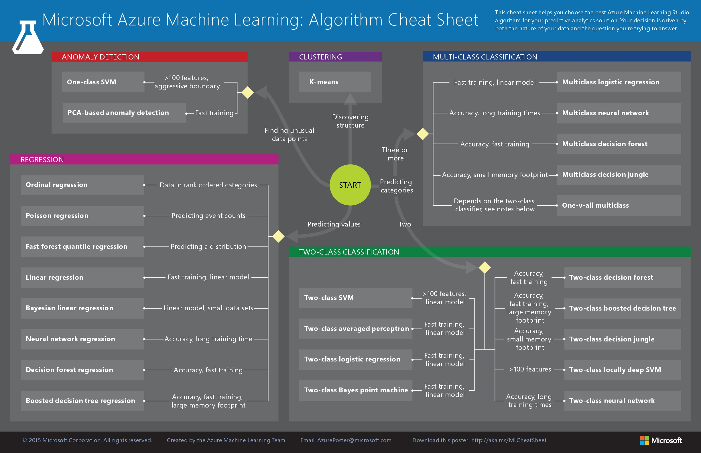

# 機械学習概要

Microsoft Azureのページで紹介されている分類をベースに解説する。

（From:https://docs.microsoft.com/ja-jp/azure/machine-learning/machine-learning-algorithm-cheat-sheet）

## 教師あり学習

### ２クラス分類（two-class classification）

データが2つのクラスのどちらに属するかを判断する識別器を学習する手法。

### 多クラス分類（multi-class classification）

データがどのクラスに属するかを判断する識別器を学習する手法。

### 回帰分析（regression）

ある変数とある変数の間にどのような相関関係が存在するかを学習する手法。

## 教師なし学習

### クラスタリング（clustering）

大量のサンプルデータを性質の近いもの同士に分類する手法。

### 異常検知（anomaly detection）

他と比べて異常なデータを見つけ出す手法。
