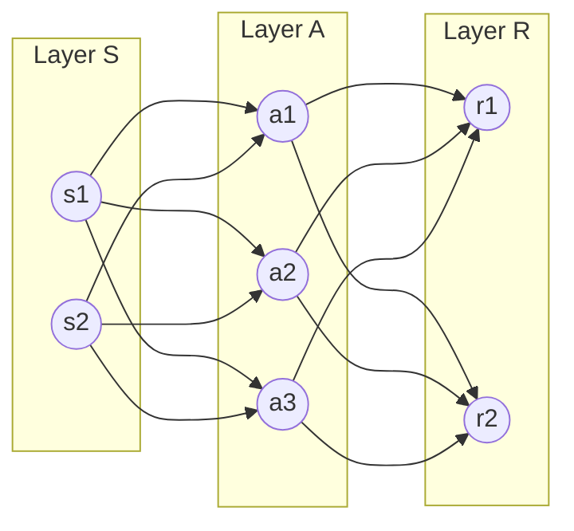
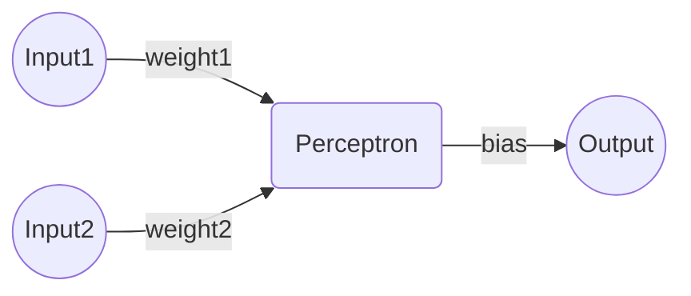

# ニューラルネットの基礎

## ニューラルネットワーク（neural network : NN）

動物の脳のシナプスの結合を基に考案された数学モデル。

入力層（S層）、中間層（隠れ層・A層）、出力層（R層）に分類される複数のノードを互いに結んだ構造をしている。

## 単純パーセプトロン（simple perceptron）

1957年にアメリカのFrank Rosenblattが提案したニューラルネットの一種。
人口ニューロンと呼ぶこともある。

### 構造

単純パーセプトロンは複数の入力・入力への重み付け・バイアスを考慮した評価値を出力する。
この時の評価値の算出に用いる関数を**活性化関数（activation function）**・**伝達関数（transfer function）**という。

また2層以上からなるパーセプトロンの集まりを**多層パーセプトロン（multi-layered perceptron）**と呼ぶこともある。

### 表現力

単純パーセプトロン1層で入力空間を線形に分類できるためNOT/AND/OR/NAND/NORを表現でき、2層にすればAND/NAND/ORの組み合わせによりXORを表現できる。

シグモイド関数を活性化関数とする2層のパーセプトロンを用いることで任意の関数を表現できることが理論的に証明されている。

## 活性化関数（activation function）

よく用いられる活性化関数として次のようなものがある。

### ステップ関数（step function）

$$\begin{eqnarray}
h(x) = \begin{cases}
1 & (x>0) \\ 0 & (x \leq 0)
\end{cases}
\end{eqnarray}$$

### シグモイド関数（sigmoid funciton）

$$\begin{eqnarray}
h(x) = \frac{1}{1+\exp(-x)}
\end{eqnarray}$$

### ReLU（reactified linear unit）

$$\begin{eqnarray}
h(x) = \begin{cases}
x & (x>0) \\ 0 & (x \leq 0)
\end{cases}
\end{eqnarray}$$

### ソフトマックス関数（soft-max function）

分類問題の出力層によく用いられる。

$$\begin{eqnarray}
h_k(x) = \frac{\exp(x_k)}{\sum\exp(x_k)}
\end{eqnarray}$$

次のような性質がある。

* $$0<h_k(x)<1$$
* $$\sum h_k = 1$$

## ニューラルネットにおける学習

教師あり学習ではパラメーター $$w$$ のNNに訓練データ $$x$$ を入力し、その結果 $$f(x;w)$$ を教師データ $$t$$ と比較し、相違に応じてパラメーター $$w$$ を調整することで学習を行う。
このときの $$t$$ と $$f(x;w)$$ の相違の度合いを評価する関数を**損失関数（loss function）**といい、NNの学習は損失関数が最小になるようなパラメーターを探索する問題に帰着する。

### バッチ学習

すべての訓練データで一度に学習させる手法。

### ミニバッチ学習

訓練データをある程度まとめて少しずつ入力して学習させる手法

### オンライン学習

学習データを1つずつ入力して学習させる手法。
