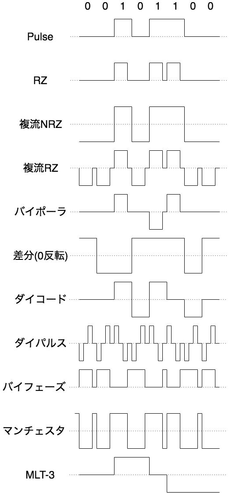

# ベースバンド伝送

## 帯域（bandwidth）

一般に周波数の範囲のことを**帯域**という。
デジタル通信においては、伝送波の帯域が伝送路容量・ボーレートなどと関連を持つことから、曖昧に伝送速度を指すような意味で用いられることも多い。

## ベースバンド（baseband）

伝送対象となる元の信号の帯域を**ベースバンド**という。

## ベースバンド伝送（ベースバンド方式）

元の信号をそのまま伝送する通信方式を**ベースバンド伝送**という。

交流成分を増やせば長距離伝送での減衰が抑えられる一方、伝送路に求められる伝送帯域が高くなる、というトレードオフがある。

* Pulse / NRZ / NRTZ
  * 単純に`0`をLow、`1`をHighとしたもの
* RZ(Return to Zero) / RTZ
  * 信号の変わり目の前に0[V]に戻す
* 複流（dipolar）
  * 信号の中で±E[V]の二極信号を利用するもの
* バイポーラ（bipolar）
  * `1`の度に極性を入れ替えるRZ
* 差分
  * `0`と`1`のどちらかで極性を反転させるもの
* ダイコード（dicode）
  * `0`から`1`のとき+E[V]、`1`から`0`のとき-E[V]、`1`や`0`が連続するときは0[V]とするもの
* ダイパルス（dipulse）
  * 正転のRZと反転のRZを1セットとしたもの
* バイフェーズ（biphase）
  * 値が変化するなら信号の変わり目で立上り・立下りするようにしたRZ
* マンチェスタ（Manchester）
  * バイフェーズを複流にしたもの
* MLT-3
  * 差分を二極信号に拡張したもの
  * `0`と`1`のどちらかで0,±E[V]の間を遷移する

