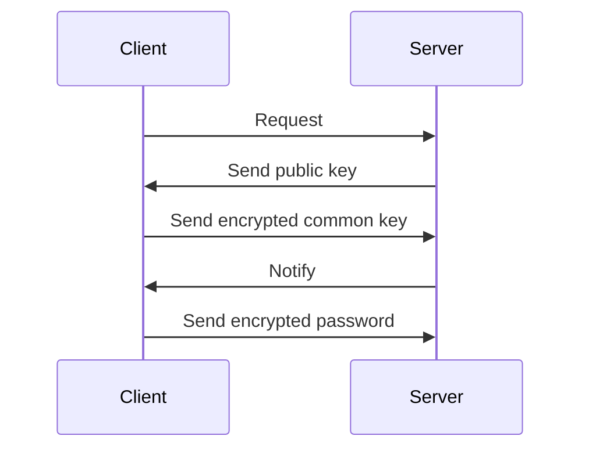
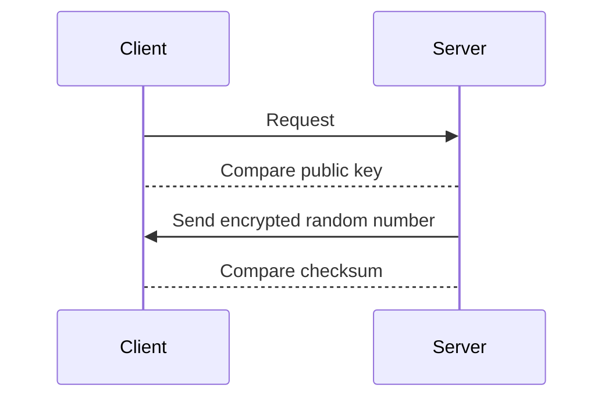

# ssh

暗号・認証を用いて安全にリモートコンピューターと通信するためのプロトコル。

実装はいくつかあるものの、最近はオープンソースのOpenSSHが一般的となっている。

sshにはパスワード認証と公開鍵認証の2種類がある。

## パスワード認証

linuxユーザーのパスワードで認証を行う。

Clientが公開鍵を使って共通鍵を暗号化して送信し、Serverが復号することで共通鍵を共有する。

パスワードを解析されるリスクが比較的高いため、利用は推奨されない。

## 公開鍵認証

Client側で生成した秘密鍵・公開鍵で認証を行う。

事前にServer側に公開鍵を登録し、Client側がそれに対応する秘密鍵を持たなければ認証されない。

