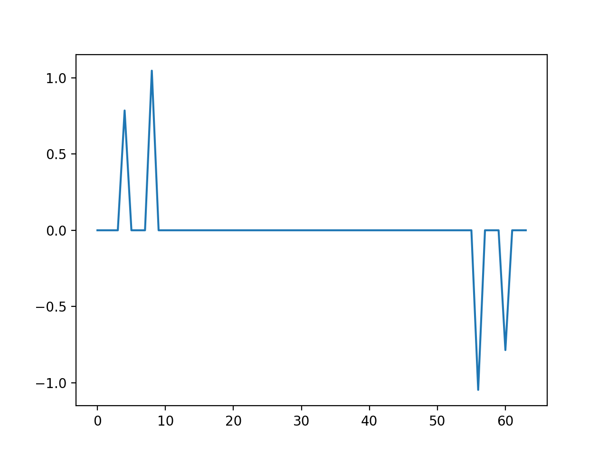

# 離散時間信号のフーリエ解析

## サンプリング定理

離散信号を扱う際、サンプリング周波数 $$f_s = 1/T$$ と観測可能な周波数の上限の間で成り立つ次の関係をサンプリング定理という。

1. サンプリング周波数 $$f_s$$ で観測したデータでは $$f_s/2$$ より上の周波数成分は失われる
2. 周波数 $$f$$ の成分を観測したければサンプリング周波数は $$f_s \geq 2f$$ でなければならない

## 離散フーリエ変換（Discrete Fourier Transform : DFT）

### 定義

サンプル数 $$N$$ の信号に対してDFTとIDFTは次のように定義される。

$$\begin{eqnarray}
X_k &=& \sum_{n=0}^{N-1} x_n e^{-2\pi jnk/N} \\
x_n &=& \frac{1}{N} \sum_{n=0}^{N-1} X_k e^{2\pi jnk/N}
\end{eqnarray}$$

### 意味

サンプリング周波数を $$f_s = 1/T$$ としたときのDFTの各パラメーターの意味は以下のようになる（$$k=0\sim N-1$$ とする）。

* 時間 $$T$$ ごとにデータを採取した
* 基本周波数は $$1/NT$$
  * $$0\sim N$$ は時間 $$NT$$ に相当する
* $$X_k$$ は $$k$$ 次高調波に相当する
  * $$k$$ 次高調波の周波数は $$k/NT$$
  * $$k$$ 次高調波の角周波数は $$2\pi k/NT$$
  * ただしサンプリング定理により周波数 $$1/2T$$ 以上の成分は検出できない
    * $$k> N/2$$ の見かけの周波数スペクトルは $$N-k$$ の周波数スペクトルの位相を反転させたものになる
    * 実際の $$k> N/2$$ の成分は $$N-k$$ の周波数スペクトルの一部として処理される
* スペクトルの見方
  * $$X_k$$：$$k$$ 次高調波の周波数スペクトル
  * $$|X_k|$$：$$k$$ 次高調波の振幅スペクトル
  * $$\angle X_k$$：$$k$$ 次高調波の位相スペクトル
  * $$|X_k|^2$$：$$k$$ 次高調波のエネルギースペクトル

### 行列表現

$$W = e^{-2\pi j/N}$$ とするとDFTは次のように表される。

$$\begin{eqnarray}
\begin{bmatrix} X_0 \\ X_1 \\ X_2 \\ \vdots \\ X_{N-1} \end{bmatrix}
&=& \begin{bmatrix} W^0 & W^0 & W^0 & \cdots & W^0 \\
W^0 & W^1 & W^2 & \cdots & W^{(N-1)} \\
W^0 & W^2 & W^4 & \cdots & W^{2(N-1)} \\
\vdots & \vdots & \vdots & \ddots & \vdots \\
W^0 & W^{N-1} & W^{2(N-1)} & \cdots & W^{(N-1)^2}
\end{bmatrix}
\begin{bmatrix}
x_0 \\ x_1 \\ x_2 \\ \vdots \\ x_{N-1}
\end{bmatrix}
\end{eqnarray}$$

これを $$X = Ax$$ と見れば、$$A$$ は $$AA^H = A^HA = I$$ を満たすため、逆フーリエ変換は次のように表される。

$$\begin{eqnarray}
x = \frac{1}{N} A^H X
\end{eqnarray}$$

### 実装

ナイーブに実装した場合、データ長 $$N$$ のDFTは $$W^k$$ の計算を含む $$O(N^2)$$ の処理となり計算時間が長くなる。
そこで実用的な実装として[高速フーリエ変換（FFT）](../algorithm/fast_fourier_transform.md)が広く用いられる。

### 周期信号のDFT

$$N=64$$ 、$$x_n = \cos(4\pi n/N) + 2\cos(8\pi n/N+\pi/4) + 3\cos(16\pi n/N+\pi/3)$$ を入力とした場合。



### 非周期信号のDFT


## ピリオドグラム（periodgram）

信号にはある程度のノイズが含まれていることが想定されるため、確率的な扱いをしたいケースがある。
**ピリオドグラム**は角周波数 $$\Omega$$ ごとにエネルギースペクトルの平均を計算し、ノイズの影響を減らしたものである。

$$\begin{eqnarray}
P(\Omega) = \frac{1}{N} \left| \sum_{n=0}^{N-1} x_n e^{-jn\Omega T} \right| ^2
\end{eqnarray}$$

## ソースコード

周期信号のDFT

```py
import numpy as np
import matplotlib.pyplot as plt

n = 64
ts = np.array([i for i in range(n)])
raw = np.cos(4*np.pi*ts/n) + 2*np.cos(8*np.pi*ts/n+np.pi/4) + 3*np.cos(16*np.pi*ts/n+np.pi/3)

#plt.plot(ts, raw); plt.show()

#radix2dft, radix2idftが必要

dft = radix2fft(raw)
amp = np.absolute(dft)
phs = np.arctan2(np.array(dft.imag, dtype=np.int), np.array(dft.real, dtype=np.int))

#plt.plot(ts, amp); plt.show()
#plt.plot(ts, phs); plt.show()
```

非周期信号のDFT

```py
import numpy as np
import matplotlib.pyplot as plt
import cv2

img = cv2.imread('Lenna.png', cv2.IMREAD_GRAYSCALE)
smp = cv2.cvtColor(img, cv2.COLOR_GRAY2RGB)
for i in range(512):
    smp[100][i] = [255, 0, 0]
    smp[200][i] = [0, 0, 255]
cv2.imwrite('fft_lenna.png', smp)

r1 = img[100]
r2 = img[200]
xs = [x for x in range(512)]

#plt.plot(xs, r1, color='blue'); plt.plot(xs, r2, color='red'); plt.show()

#radix2dft, radix2idftが必要

dft1 = radix2fft(r1)
amp1 = np.absolute(dft1)
phs1 = np.arctan2(np.array(dft1.imag, dtype=np.int), np.array(dft1.real, dtype=np.int))
dft2 = radix2fft(r2)
amp2 = np.absolute(dft2)
phs2 = np.arctan2(np.array(dft2.imag, dtype=np.int), np.array(dft2.real, dtype=np.int))

#plt.plot(xs, amp1, color='blue'); plt.plot(xs, amp2, color='red'); plt.show()
#plt.plot(xs, phs1, color='blue'); plt.plot(xs, phs2, color='red'); plt.show()
```
