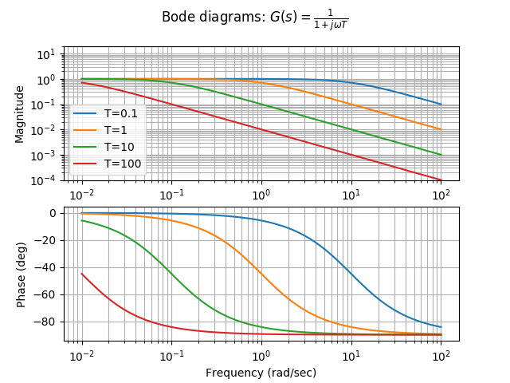
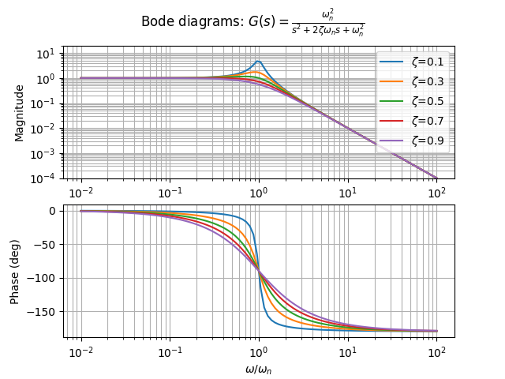

# ボード線図（Bode diagram）

システムの周波数特性について考えるとき、入力周波数とゲイン・位相の関係をグラフで表現したものを**ボード線図**と呼ぶ。

一般的に、横軸に各周波数の対数、縦軸にゲインのデシベル値もしくは位相を置く。

>デシベル

>電圧・音圧：$$20\log_{10} V$$

ボード線図には次のような利点がある。

* 広い周波数帯域を1つの図で扱える
* 複雑な伝達関数の周波数特性もボード線図の和として表現できる
* 折れ線近似が容易なため、周波数特性の概略が簡単に精度良く得られる

## ボード線図の性質

あるシステムがある周波数 $$\omega^*$$ において伝達関数 $$G(j\omega^*) = \prod_{i=1}^n G_i(j\omega^*)$$ を持つとき、

$$
\begin{eqnarray}
G(j\omega^*) &=& G_1(j\omega^*) \cdot G_2(j\omega^*) \cdots G_n(j\omega^*) \\
&=& r_1 e^{j\theta_1} \cdot r_2 e^{j\theta_2} \cdots r_n e^{j\theta_n} \\
&=& (r_1r_2\cdots r_n)e^{j(\theta_1 + \theta_2 + \cdots + \theta_n)}
\end{eqnarray}
$$

より

$$
\begin{eqnarray}
20\log_{10} |G(j\omega)| &=& \sum_{i=1}^n 20\log_{10} |G_i(j\omega)| \\
\angle G(j\omega) &=& \sum_{i=1}^n \angle G_i(j\omega)
\end{eqnarray}
$$

となる。

この式から、**伝達関数の乗算（システムの直列結合）はボード線図の和算に相当する**ことがわかる。そのため、基本的な伝達関数のボード線図上の形状がわかっていれば、複雑な伝達関数のボード線図も容易に書くことができる。

## 1次系のシステムのボード線図

$$
G(s)=\frac{1}{1+j\omega T}
$$



>Python 3.6.1, numpy 1.12.0, matplotlib 2.0.1, control 0.7.0

```py
import numpy as np
from control import matlab
import matplotlib.pyplot as plt

#plotしたい周波数のリスト（指定しなければ自動で適当な範囲を描画してくれる）
omegas = np.logspace(-2, 2, 100)

for t in [0.1, 1, 10, 100]:
    tf = matlab.tf([1], [t, 1]) #制御対象
    matlab.bode(tf, omegas)

sp_gain = plt.subplot(211)
sp_gain.set_ylim(-40, 20)
plt.legend(('T=0.1', 'T=1', 'T=10', 'T=100'))
plt.suptitle('Bode diagrams: $G(s)=\\frac{1}{1+j\\omega T}$')
plt.show()
```

## 2次系のシステムのボード線図

$$
G(s)=\frac{\omega_n^2}{s^2+2\zeta \omega_n s + \omega_n^2}
$$



```py
import numpy as np
from control import matlab
import matplotlib.pyplot as plt

#plotしたい周波数のリスト（指定しなければ自動で適当な範囲を描画してくれる）
omegas = np.logspace(-2, 2, 100)

for z in [0.1, 0.3, 0.5, 0.7, 0.9]:
    tf = matlab.tf([1], [1, 2*z, 1]) #制御対象
    matlab.bode(tf, omegas)

sp_gain = plt.subplot(211)
sp_gain.set_ylim(-40, 20)
sp_phase = plt.subplot(212)
sp_phase.set_xlabel('$\\omega/\\omega_n$')
plt.legend(('$\\zeta$=0.1', '$\\zeta$=0.3', '$\\zeta$=0.5', '$\\zeta$=0.7', '$\\zeta$=0.9'))
plt.suptitle('Bode diagrams: $G(s)=\\frac{\\omega_n^2}{s^2+2\\zeta \\omega_n s + \omega_n^2}$')
plt.show()
```
