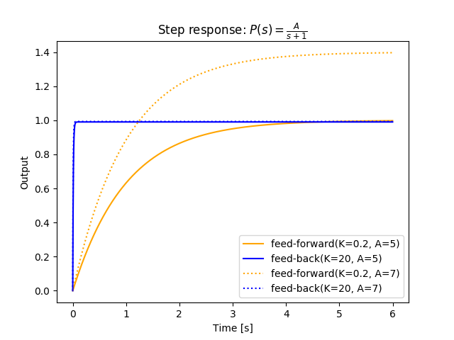

# フィードバック制御系の特性

フィードバック制御系はフィードフォワード制御系と比較して次のような特性を持つ。

* 制御対象のパラメーターの変動の影響を受けづらい
* 入力の変動時の速応性が改善される
* 外乱に強くなる
* 定常特性が改善される
  * 一巡伝達関数が含む$$1/s$$の積分器の数によって定常偏差の特性が定まる
    * $$1/s$$の積分器を1つ以上含めば定常位置偏差は0となり、外乱に対する定常偏差も0となる
    * 周波数成分$$s=0$$に対して感度関数が0になるため

## 伝達関数

制御対象が1次系、制御機が定数ゲインの制御システムを例にとる。
　
$$
P(s) = \frac{A}{\tau s + 1}, \ \ \ K(s) = K
$$

上記のシステムのフィードフォワード系とフィードバック系の伝達関数はそれぞれ次のようになる。

$$
\begin{eqnarray}
G_f(s) &=& \frac{AK}{\tau s + 1} \\
G_b(s) &=& \frac{AK}{\tau s + 1 + AK}
\end{eqnarray}
$$

## 感度特性

下の図を見てわかるように、フィードフォワード制御系では制御対象のパラメーターの変動・誤差（ここでは$$A:5 \rightarrow 7$$）がそのまま現れてしまう。

一方、フィードバック制御系ではゲインを大きくするほど**変動の影響が大幅に減少し速応性が改善される**。

制御対象の伝達関数が$$P(s) \rightarrow \tilde{P}(s)$$のように変化したとき、系全体の伝達関数が$$T(s) \rightarrow \tilde{T}(s)$$と変化したとすると、双方の変動率には

$$
\frac{T(s)-\tilde{T}(s)}{\tilde{T}(s)} = \frac{1}{1+P(s)K(s)} \cdot \frac{P(s)-\tilde{P}(s)}{\tilde{P}(s)}
$$

のような関係がある。この比率を **感度関数（sensitivity function）** と呼ぶ。



## 外乱に対する感度特性

$$P(s)$$への入力に$$d(s)$$の外乱が混ざるとする。このとき外乱が出力に与える変化量$$y_d(t)$$はフィードフォワード系・フィードバック系でそれぞれ

$$
\begin{eqnarray}
y_d(s) &=& P(s)d(s) \\
y_d(s) &=& \frac{P(s)}{1+P(s)K(s)}d(s)
\end{eqnarray}
$$

となるため、先ほどの条件下では

$$
\begin{eqnarray}
\lim_{t \rightarrow \infty} y_d(t) &=& 5d(s) \\
\lim_{t \rightarrow \infty} y_d(t) &=& 0.05d(s)
\end{eqnarray}
$$

となる。

ここから、フィードバック系は**外乱に対しても強くなる**ことが確認できる。

## 目標値に対する定常特性

フィードバック系の制御量と目標値の偏差について考える。

追従偏差を $$e(t)=r(t)-y(t)$$ とすると、閉ループを一巡したときの伝達関数（**一巡伝達関数** ・ **開ループ伝達関数**）は$$P(s)K(s)$$であるため、

$$
e(s)=\frac{1}{1+P(s)K(s)}r(s)
$$

となる。

以下で確認できるように、位置・速度・加速度のいずれにおいても**ゲインを高くするほど偏差は小さくなる**。

### ステップ入力

$$r(s)=1$$のステップ入力の定常偏差（steady-state error）は

$$
\begin{eqnarray}
e_s &=& \lim_{s \rightarrow 0}s\frac{1}{1+P(s)K(s)}\frac{1}{s} \\
&=& \frac{1}{1+\lim_{s \rightarrow 0}P(s)K(s)}
\end{eqnarray}
$$

となる。ステップ入力の定常偏差を特に **定常位置偏差（steady-state position error）** 、$$K_p=\lim_{s \rightarrow 0}P(s)K(s)$$を **位置偏差定数（position error constant）** と呼ぶ。

### ランプ入力

$$r(s)=t$$のランプ入力の定常偏差は

$$
\begin{eqnarray}
e_s &=& \lim_{s \rightarrow 0}s\frac{1}{1+P(s)K(s)}\frac{1}{s^2} \\
&=& \lim_{s \rightarrow 0}\frac{1}{sP(s)K(s)}
\end{eqnarray}
$$

となる。ランプ入力の定常偏差を特に **定常速度偏差（steady-state velocity error）** 、$$K_v=\lim_{s \rightarrow 0}sP(s)K(s)$$を **速度偏差定数（velocity error constant）** と呼ぶ。

### 一定加速度入力

$$r(s)=\frac{t^2}{2}$$の一定加速度入力の定常偏差は

$$
e_s = \lim_{s \rightarrow 0} \frac{1}{s^2P(s)K(s)}
$$

となる。一定加速度入力の定常偏差を特に **定常加速度偏差（steady-state acceleration error）** 、$$K_a=\lim_{s \rightarrow 0} s^2 P(s)K(s)$$を **加速度偏差定数（acceleration error constant）** と呼ぶ。

### 制御系の型と定常偏差

上記からわかるように、一巡伝達関数$$P(s)K(s)$$に$$1/s$$の積分器がいくつ含まれてるかによって定常位置偏差・定常速度偏差・定常加速度偏差の特性が決まる。
$$1/s^l$$の積分器を含む制御系を**$$l$$型の制御系**と呼ぶ。

|型|$$r(t)=1$$|$$r(t)=t$$|$$r(t)=t^2/2$$|
|----|----|----|----|
|0型|$$\frac{1}{1+K_p}$$|$$\infty$$|$$\infty$$|
|1型|$$0$$|$$\frac{1}{K_v}$$|$$\infty$$|
|2型|$$0$$|$$0$$|$$\frac{1}{K_a}$$|

特に定常位置偏差に注目すると**1つ以上の$$1/s$$の積分器を持つ制御系では定常偏差0が実現される**ことがわかる。
これは周波数成分 $$s=0$$ に対して一巡伝達関数が無限のゲインを持つ（$$P(0)K(0) = \infty$$）ことで感度関数が0になるため、と解釈できる。

## 外乱に対する定常偏差

$$P(s)$$への入力に$$d(s)$$の外乱が混ざるとする。このとき外乱が出力に与える変化量$$y_d(t)$$は

$$
y_d(s) = \frac{P(s)}{1+P(s)K(s)}d(s)
$$

となる。ここで外乱がステップ入力であるとすると、

$$
\lim_{t \rightarrow \infty}y_d(t) = \lim_{x \rightarrow 0}sy(s) = \frac{P(0)}{1+P(0)K(0)}
$$

となるため、外乱による定常偏差を0とするためには$$P(0)=0$$または$$K(0)=\infty$$である必要がある。

プロパーな制御対象が$$P(0)=0$$を満たすことはないため、実質的に**$$K(s)$$が$$1/s$$の積分器を持つ**ことが外乱に対する定常偏差を0にする条件となる。

## グラフのソースコード

>Python 3.6.1, matplotlib 2.0.1, control 0.7.0

```py
from control import matlab
import matplotlib.pyplot as plt
import numpy as np

t = np.arange(0, 6, 0.001)

#A=5
tf_p = matlab.tf([5], [1, 1]) #制御対象（τ=1）

#フィードフォワード
tf_k1 = matlab.tf([0.2], [1]) #制御器（ゲイン:0.2）
forward = tf_k1 * tf_p

#フィードバック
tf_k2 = matlab.tf([20], [1]) #制御器（ゲイン:20）
back = matlab.feedback(tf_k2*tf_p, 1, -1)

y_out, t_out = matlab.step(forward, t)
plt.plot(t_out, y_out, c='orange', label='feed-forward(K=0.2, A=5)')

y_out, t_out = matlab.step(back, t)
plt.plot(t_out, y_out, c='blue', label='feed-back(K=20, A=5)')

#----------
#A=7
tf_p = matlab.tf([7], [1, 1]) #制御対象（τ=1）

#フィードフォワード
tf_k1 = matlab.tf([0.2], [1]) #制御器（ゲイン:0.2）
forward = tf_k1 * tf_p

#フィードバック
tf_k2 = matlab.tf([20], [1]) #制御器（ゲイン:20）
back = matlab.feedback(tf_k2*tf_p, 1, -1)

y_out, t_out = matlab.step(forward, t)
plt.plot(t_out, y_out, c='orange', linestyle=':', label='feed-forward(K=0.2, A=7)')

y_out, t_out = matlab.step(back, t)
plt.plot(t_out, y_out, c='blue', linestyle=':', label='feed-back(K=20, A=7)')

plt.title('Step response: $P(s)=\\frac{A}{s+1}$')
plt.xlabel('Time [s]')
plt.ylabel('Output')
plt.legend()
plt.show()

```
