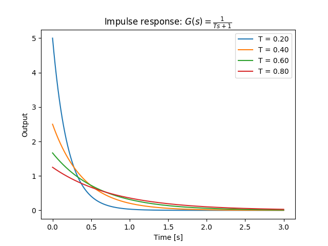
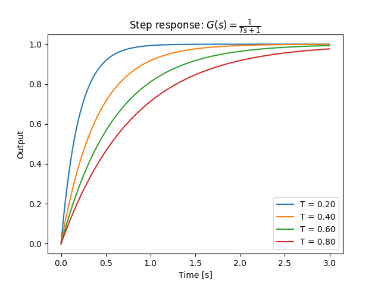

# 1次系の応答

## 1次系（First Order System）

伝達関数が

$$
G(s) = \frac{K}{Ts+1} \ \ \ (T>0,K>0)
$$

の形で与えられるシステムは1次系と呼ばれる。

## インパルス応答

1次系のインパルス応答は次のようになる。

$$
\begin{eqnarray}
y(t) &=& \mathscr{L}^{-1}[G(s)] \\
&=& \frac{K}{T}e^{-t/T}
\end{eqnarray}
$$

## ステップ応答

1次系のステップ応答は次のようになる（インパルス応答を積分して求めた）。

$$
\begin{eqnarray}
y(t) &=& \int_0^t \frac{K}{T}e^{-\tau/T}d\tau \\
&=& K(1-e^{-t/T})
\end{eqnarray}
$$

以上からステップ応答の定常値・初期速度は次のようになる。

$$
\lim_{t \to \infty}y(t) = K, \ \ \ \frac{dy}{dt}|_ {t=0} = \frac{K}{T}
$$

## パラメーターの意味

* ゲイン $$K$$
  * 定常状態でのゲイン（定常値が入力信号の$$K$$倍になる）
* 時定数 $$T$$
  * 収束の速さ
  * 出力が初期速度のまま進めば$$T$$秒後に定常値に到達する
  * 時刻$$t=T$$において定常値の63.2%になる

## インパルス応答（Python）

>Python 3.6.1, matplotlib 2.0.1, control 0.7.0

```py
from control import matlab
import matplotlib.pyplot as plt

for i in range(1, 5):
  K = 1 #ゲイン
  T = 0.2 * i #時定数
  t = np.arange(0, 3, 0.001)

  tf = matlab.tf([K], [T, 1])

  y_out, t_out = matlab.impulse(tf, t)
  plt.plot(t_out, y_out, label='T = ' + '%.2f'%T)

plt.title('Impulse response: $G(s)=\\frac{1}{Ts+1}$')
plt.xlabel('Time [s]')
plt.ylabel('Output')
plt.legend()
plt.show()

```



## ステップ応答（Python）

>Python 3.6.1, matplotlib 2.0.1, control 0.7.0

```py
from control import matlab
import matplotlib.pyplot as plt

for i in range(1, 5):
  K = 1 #ゲイン
  T = 0.2 * i #時定数
  t = np.arange(0, 3, 0.001)

  tf = matlab.tf([K], [T, 1])

  y_out, t_out = matlab.step(tf, t)
  plt.plot(t_out, y_out, label='T = ' + '%.2f'%T)

plt.title('Step response: $G(s)=\\frac{1}{Ts+1}$')
plt.xlabel('Time [s]')
plt.ylabel('Output')
plt.legend()
plt.show()

```


