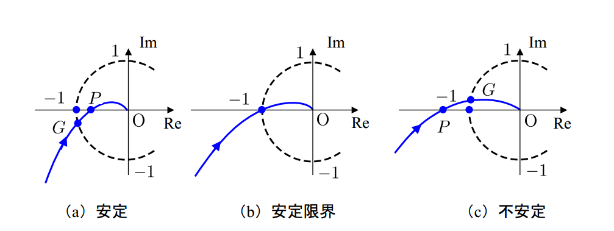

# ゲイン余裕・位相余裕

開ループ伝達関数が安定であるときの[ナイキストの安定判別法](nyquist_diagram.md)では、ベクトル軌跡が点 $$(-1,0)$$ を左右どちらに見ながら動くかを調べることで安定性を判別した。

同様にベクトル軌跡を見れば安定限界までの余裕を評価することもできる。

$$\omega = 0 \rightarrow \infty$$ のとき、原点周りのベクトル軌跡は下の図のような軌跡を描く。

（From : http://cmorito.blogspot.jp/2012/05/blog-post_24.html）

## 用語

### ゲイン交差周波数（gain crossover frequency）

点 $$G$$ は $$|P(j \omega_{gc})K(j \omega_{gc})| = 1$$ になるような各周波数 $$\omega_{gc}$$ と対応しており、$$\omega_{gc}$$ を**ゲイン交差周波数**という。

### 位相交差周波数（phase crossover frequency）

点 $$P$$ は $$\angle P(j \omega_{pc})K(j \omega_{pc}) = -180^\circ$$ となるような角周波数 $$\omega_{pc}$$ と対応しており、$$\omega_{pc}$$ を**位相交差周波数**という。

## ゲイン余裕（gain margin）

位相交差周波数において開ループ伝達関数のゲインを何倍にすればシステムが不安定になるかを**ゲイン余裕**という。
一般的にデシベル値で表現される。

$$
\begin{eqnarray}
GM &=& \frac{1}{|OP|} \\
&=& -20 \log{|OP|} \ \ \ [dB]
\end{eqnarray}
$$

## 位相余裕（phase margin）

ゲイン交差周波数において開ループ伝達関数の位相がどれだけ遅れるとシステムが不安定になるかを**位相余裕**という。

$$
PM = \angle GOP
$$
