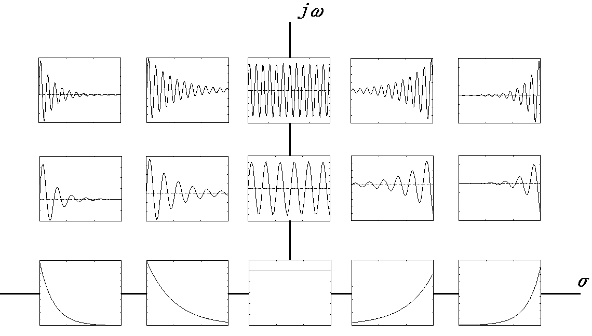

# 極・零点と過渡応答

>## 復習：伝達関数の定義

>

$$
G(s) = \frac{N(s)}{D(s)} = \frac{b_ms^m+b_{m-1}s^{m-1}+\ \dots \ +b_0}{s^n+a_{n-1}s^{n-1}+\ \dots \ +a_0}
$$

## 極（pole）

$$D(s)=0$$を満たす根（解）を **極** という。

## 零点（zero）

$$N(s)=0$$を満たす根（解）を **零点** という。

## 極・零点と過渡応答の関係

一般的な高次システムとして、伝達関数$$G(s)$$、実極$$-\sigma_i(i=1~M)$$・複素数共役極$$-\alpha_i \pm j\omega_i(i=1~N)$$を持つシステムを考える。
なお簡単のためすべての極は互いに異なるものとする。

このシステムのステップ応答のラプラス変換を部分分数分解すると次のようになる。

$$
y(s) = \frac{A_0}{s}+\sum_{i=1}^M \frac{A_i}{s+\sigma_i}+\sum_{i=1}^N \frac{B_i}{(s+\alpha_i)^2+\omega_i^2}
$$

これを逆ラプラス変換すると以下のようになる。

$$
y(t) = A_0+\sum_{i=1}^M A_i e^{-\sigma_i t}+\sum_{i=1}^N\frac{B_i}{\omega_i} e^{-\alpha_i t} \sin{\omega_i t}
$$

### 極の影響

上記の式から、高次システムの過渡応答は **各極に対応するインパルス応答の重ね合わせ** によって表現できることがわかる。

* 第1項は極（$$s=0$$）に対応するインパルス応答。
  * これが定常値となる。
* 第2項・第3項は$$G(s)$$の各極（$$s=-\sigma_i,-\alpha_i \pm j\omega_i$$）に対応するインパルス応答。
  * これが過渡応答を形成する。

極とインパルス応答の対応イメージを以下に示す。

（出典：[http://ysserve.wakasato.jp/Lecture/ControlMecha1/node16.html](http://ysserve.wakasato.jp/Lecture/ControlMecha1/node16.html)）

#### 代表極・代表特性根（dominant pole）

過渡応答に最も影響を与える極のことを **代表極・代表特性根** という。

たとえば上記の式では$$\sigma_i, \alpha_i$$が0に近いほど$$e^{-\sigma t}, e^{-\alpha t}$$の収束が遅くなることが分かる。
つまり$$A_i,B_i$$に大きな差がない場合、応答はこれらの遅いモードが支配的になるはずであり、最も0に近い$$\sigma_i$$もしくは$$\alpha_i$$が代表極となる。

### 零点の影響

零点は極と共に上記の式の$$A_i, B_i$$に影響を与える。

（$$\frac{b_ms^m+b_{m-1}s^{m-1}+\ \dots \ +b_0}{s^n+a_{n-1}s^{n-1}+\ \dots \ +a_0}$$の部分分数分解の過程を追わなければならないため定性的な評価は面倒）

零点の影響により、逆ぶれ（定常値と逆の方向にふれること）を生じたり、実極しか存在しないにもかかわらずオーバーシュートが生じたりする。
