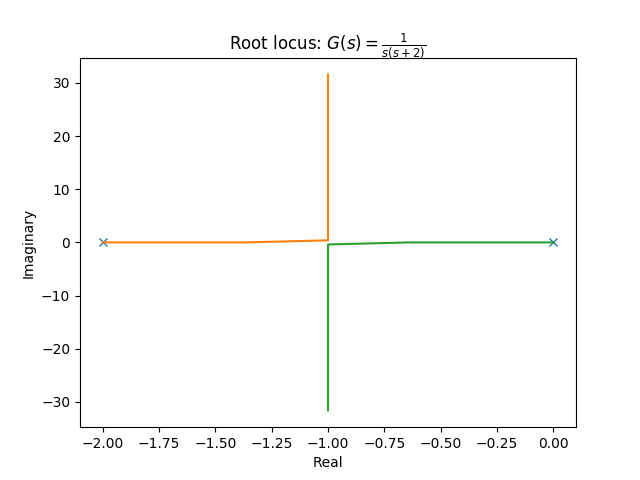
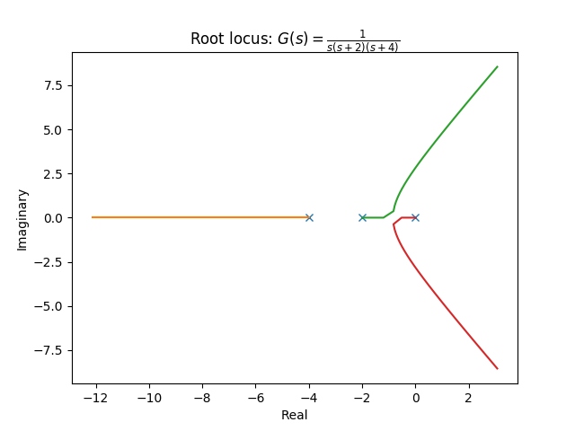
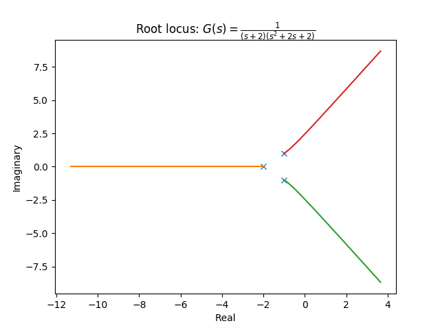

# 根軌跡（root locus）

根軌跡はフィードバック制御系においてゲイン$$K$$を変えたとき極がどのように変化するかを示した図である。
**ゲインに対してシステムの安定性がどのように変化するか**を一望できる図として制御設計において重要視される要素のひとつとなっている。

## 定義

定数ゲイン（ゲイン：$$K$$）の直結フィードバック制御系について、伝達関数が次のように規格化されているとする。

$$
G(s) = \frac{(s-z_1)(s-z_2)\cdots(s-z_m)}{(s-p_1)(s-p_2)\cdots(s-p_n)}
$$

このときの閉ループの伝達関数は

$$
\frac{KG(s)}{1+KG(s)} = \frac{KN(s)}{D(s)+KN(s)}
$$

となり、その極は次の特性方程式

$$
1+KG(s) = D(s)+KN(s)=0
$$

を満たす。

ここで$$K$$を$$0\rightarrow \infty$$のように変化させたとき、極は複素数平面上を動くはずである。このときの極の軌跡を**根軌跡**と呼ぶ。根軌跡を示すグラフでは$$G(s)$$の極を×、零点を○で示し、$$K$$が増大する方向に矢印をつけるのが慣例となっている。

## 根軌跡の性質

1. 根軌跡は開ループ伝達関数$$G(s)$$の極 $$p_i(1 \leq i \leq n)$$ から出発し、そのうち$$m$$本の軌跡の終端は$$G(s)$$の零点 $$z_i(1 \leq i \leq m)$$ であり、残りの $$n-m$$ 本の軌跡は無限遠点に発散する
1. 無限遠点に至る根軌跡の漸近線の角度は $$\frac{180^\circ+360^\circ l}{n-m}$$ （$$l$$は任意の整数）となる
   * つまり実数軸の負の方向を基準に一周を $$n-m$$ 分割するような漸近線が描かれる
1. 実軸上の点の右側に、重複度も考慮して実極と実零点が合計奇数個あればその点は根軌跡上の点である
1. 根軌跡が実軸状から分岐・合流する点は $$\frac{d}{ds}\frac{1}{G(s)}=0$$ を満たす
1. 複素極 $$p_j$$ から根軌跡が出発する角度は $$180^\circ-\sum_{i \neq j} \angle (p_j-p_i) + \sum_{i=1}^m \angle (p_j - z_i)$$ 、複素零点 $$z_j$$ へ根軌跡が終端する角度は $$180^\circ + \sum_{i=1}^n \angle(z_j-p_i)-\sum_{i \neq j} \angle (z_j-z_i)$$ となる





## グラフのソースコード

>Python 3.6.1, matplotlib 2.0.1, control 0.7.0

```py
from control import matlab
import matplotlib.pyplot as plt

tf = matlab.tf([1], [1, 2, 0]) #制御対象

matlab.rlocus(tf)

plt.title('Root locus: $G(s)=\\frac{1}{s(s+2)}$')
plt.show()

```

```py
from control import matlab
import matplotlib.pyplot as plt

tf = matlab.tf([1], [1, 6, 8, 0]) #制御対象

matlab.rlocus(tf)

plt.title('Root locus: $G(s)=\\frac{1}{s(s+2)(s+4)}$')
plt.show()

```

```py
from control import matlab
import matplotlib.pyplot as plt

tf = matlab.tf([1], [1, 4, 6, 4]) #制御対象

matlab.rlocus(tf)

plt.title('Root locus: $G(s)=\\frac{1}{(s+2)(s^2+2s+2)}$')
plt.show()

```
