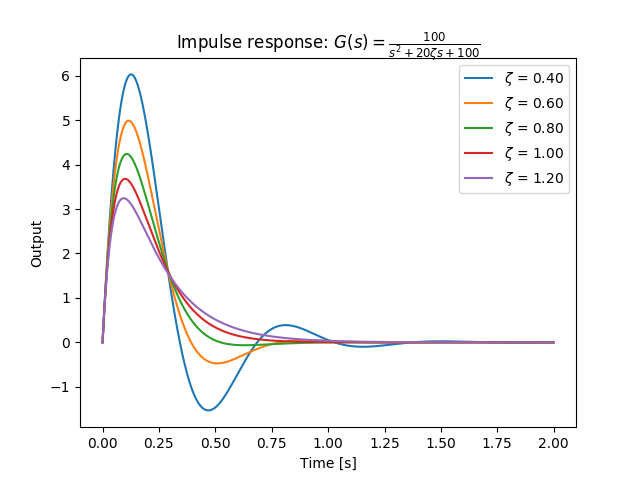
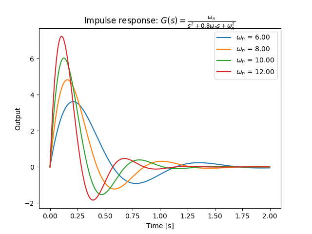
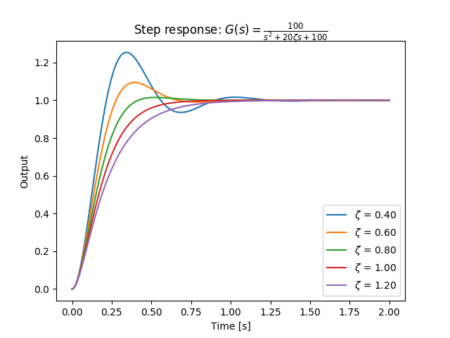
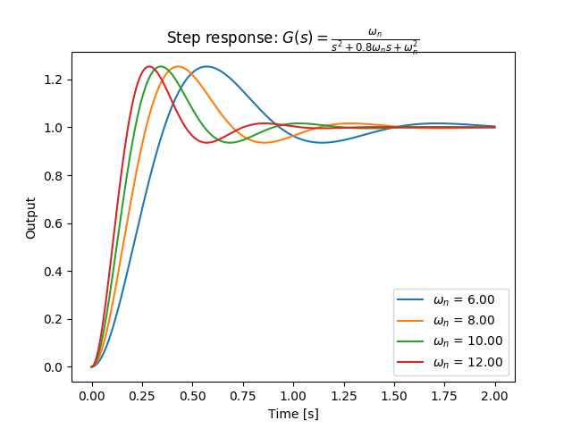

# 2次系の応答

## 2次系（second order system）

伝達関数が

$$
G(s) = \frac{b_0}{s^2+a_1 s+a_2} \ \ \ (b_0>0,a_1>0,a_2>0)
$$

の形で与えられるシステムは2次系と呼ばれる。

上記の式は解析のしやすさを考えて次のような形で表すことが多い。

$$
G(s) = \frac{K\omega_n^2}{s^2+2\zeta\omega_ns+\omega_n^2} \ \ \ (K>0,\zeta>0,\omega_n>0)
$$

## インパルス応答

2次系のインパルス応答は次のようになる。

$$
\begin{eqnarray}
y(t) &=& \mathscr{L}^{-1}[G(s)] \\
&=& \frac{K\omega_n}{\sqrt{1-\zeta^2}}e^{-\zeta\omega_nt}\sin(\omega_dt)
\end{eqnarray}
$$

## ステップ応答

2次系のステップ応答は次のようになる（部分分数分解を用いて求めた）。

$$\omega_d = \omega_n\sqrt{1-\zeta^2}$$ と置いて

$$
\begin{eqnarray}
y(t) &=& \mathscr{L}^{-1}\left[G(s)\frac{1}{s}\right] \\
&=& \mathscr{L}^{-1}\left[\frac{K}{s} - \frac{K(s+2\zeta\omega_n)}{s^2+2\zeta\omega_ns+\omega_n^2}\right] \\
&=& \mathscr{L}^{-1}\left[\frac{K}{s} - \frac{K(s+\zeta\omega_n)}{(s+\zeta\omega_n)^2+\omega_d^2} - \frac{K\zeta}{\sqrt{1-\zeta^2}}\frac{\sqrt{1-\zeta^2}\omega_n}{(s+\zeta\omega_n)^2+\omega_d^2}\right] \\
&=& K\left\{1-\frac{e^{-\zeta\omega_nt}}{\sqrt{1-\zeta^2}}\sin(\omega_dt+\theta)\right\} \\ &\ & \left(\theta=\tan^{-1}\frac{\sqrt{1-\zeta^2}}{\zeta}\right)
\end{eqnarray}
$$

## パラメーターの意味

後に示すグラフを見ればわかるように、各パラメーターは応答に次のような影響を与える。

* ゲイン $$K$$
  * 定常状態でのゲイン（定常値が入力信号の$$K$$倍になる）
* 減衰係数 $$\zeta$$
  * 振動減衰（damping）の特性を定める
    * $$\zeta<1$$：不足制動（under damping）
    * $$\zeta=1$$：臨界制動（critical damping）
    * $$\zeta>1$$：過制動（over damping）
* 自然角周波数 $$\omega_n$$
  * 速応性を定める
  * 実際は $$\omega_d = \omega_n\sqrt{1-\zeta^2}$$ が振動の周波数になる

## インパルス応答（Python）

>Python 3.6.1, matplotlib 2.0.1, control 0.7.0

```py
from control import matlab
import matplotlib.pyplot as plt

for i in range(2, 7):
  K = 1 #ゲイン
  zeta = 0.2 * i #時定数
  omega_n = 10
  t = np.arange(0, 2, 0.001)

  tf = matlab.tf([K*omega_n**2], [1, 2*zeta*omega_n, omega_n**2])

  y_out, t_out = matlab.impulse(tf, t)
  plt.plot(t_out, y_out, label='$\\zeta$ = ' + '%.2f'%zeta)

plt.title('Impulse response: $G(s)=\\frac{100}{s^2+20\\zeta s+100}$')
plt.xlabel('Time [s]')
plt.ylabel('Output')
plt.legend()
plt.show()

```



>Python 3.6.1, matplotlib 2.0.1, control 0.7.0

```py
from control import matlab
import matplotlib.pyplot as plt

for i in range(3, 7):
  K = 1 #ゲイン
  zeta = 0.4 #時定数
  omega_n = 2 * i
  t = np.arange(0, 2, 0.001)

  tf = matlab.tf([K*omega_n**2], [1, 2*zeta*omega_n, omega_n**2])

  y_out, t_out = matlab.impulse(tf, t)
  plt.plot(t_out, y_out, label='$\\omega_n$ = ' + '%.2f'%omega_n)

plt.title('Impulse response: $G(s)=\\frac{\\omega_n}{s^2+0.8\\omega_n s+\\omega_n^2}$')
plt.xlabel('Time [s]')
plt.ylabel('Output')
plt.legend()
plt.show()

```



## ステップ応答（Python）

>Python 3.6.1, matplotlib 2.0.1, control 0.7.0

```py
from control import matlab
import matplotlib.pyplot as plt

for i in range(2, 7):
  K = 1 #ゲイン
  zeta = 0.2 * i #時定数
  omega_n = 10
  t = np.arange(0, 2, 0.001)

  tf = matlab.tf([K*omega_n**2], [1, 2*zeta*omega_n, omega_n**2])

  y_out, t_out = matlab.step(tf, t)
  plt.plot(t_out, y_out, label='$\\zeta$ = ' + '%.2f'%zeta)

plt.title('Step response: $G(s)=\\frac{100}{s^2+20\\zeta s+100}$')
plt.xlabel('Time [s]')
plt.ylabel('Output')
plt.legend()
plt.show()

```



>Python 3.6.1, matplotlib 2.0.1, control 0.7.0

```py
from control import matlab
import matplotlib.pyplot as plt

for i in range(3, 7):
  K = 1 #ゲイン
  zeta = 0.4 #時定数
  omega_n = 2 * i
  t = np.arange(0, 2, 0.001)

  tf = matlab.tf([K*omega_n**2], [1, 2*zeta*omega_n, omega_n**2])

  y_out, t_out = matlab.step(tf, t)
  plt.plot(t_out, y_out, label='$\\omega_n$ = ' + '%.2f'%omega_n)

plt.title('Step response: $G(s)=\\frac{\\omega_n}{s^2+0.8\\omega_n s+\\omega_n^2}$')
plt.xlabel('Time [s]')
plt.ylabel('Output')
plt.legend()
plt.show()

```


