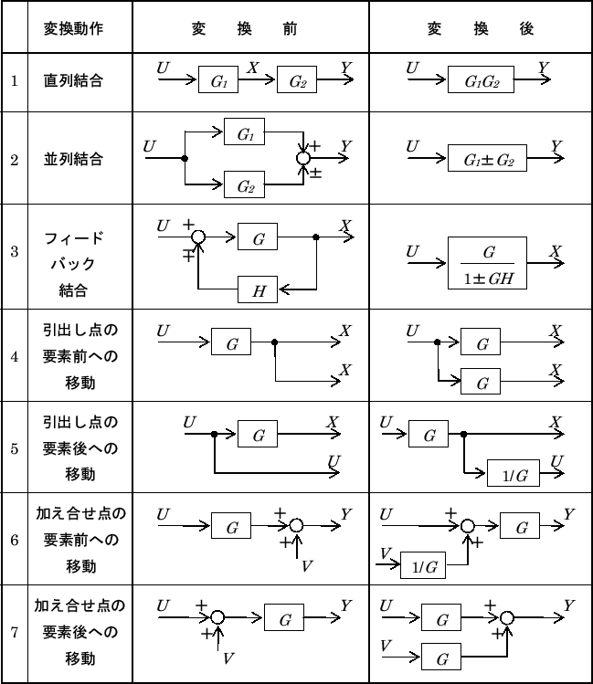

# 伝達関数2（transfer function）

## 伝達関数とブロック線図

ブロック線図のパターンと伝達関数の演算の対応表を示す。

（出典：[http://ysserve.wakasato.jp/Lecture/ControlMecha1/node10.html](http://ysserve.wakasato.jp/Lecture/ControlMecha1/node10.html)）

## むだ時間（dead time）を含む系

入力に対する応答に一定のラグ（むだ時間）を含む系は伝達関数表現と相性が悪い。

というのも、このケースでは伝達関数が指数関数となってしまうため。

### 例

$$y(t) = u(t-L)$$ は信号の伝達を $$L$$ だけ遅延させるシステム。

これをラプラス変換すると

$$
\begin{eqnarray}
  Y(s) &=& e^{-sL}U(s) \\
  G(s) &=& e^{-sL}
\end{eqnarray}
$$

となる。

### パデー近似（Pade approximation）

むだ時間を無視できない場合、次のような有理関数への近似を行うことがある。

$$
\begin{eqnarray}
  e^{-sL} &\simeq& \frac{1-Ls/2}{1+Ls/2} \\
  e^{-sL} &\simeq& \frac{1-Ls/2+(Ls)^2/12}{1+Ls/2+(Ls)^2/12}
\end{eqnarray}
$$
