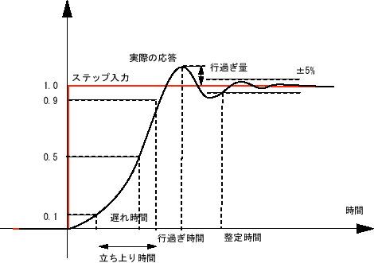

# 過渡応答（transient response）

高次システムの性質を調べる際には、すべての応答を代表させてステップ応答を評価することが多い。

その理由としては

* 実験しやすい
* 制御対象をモデル化するのに十分な情報を持っている
* 実際の制御系においても目標値がステップ状に変化するケースが多い

などがあげられる。

このようにシステムの性質を評価する目的で得たステップ応答を **過渡応答** と呼ぶ。

## 過渡応答の特性値

過渡応答の評価は次のような特性値を基に行われる。

### 立ち上り時間（rise time）$$T_r$$

定常値の10%->90%になるまでに要する時間。

### 遅れ時間（遅延時間）（delay time）$$T_d$$

定常値の50%に達するまでの時間。

### 整定時間（settling time）$$T_s$$

応答が定常値の±2%（±5%,±1%とすることもある）の範囲に収まるまでの時間。

### オーバーシュート（最大行き過ぎ量）（overshoot）$$A_{max}$$

応答のピーク値と定常値の差の最大値。

2次より高次になると「最初の行き過ぎ量＝オーバーシュート」とならないことがあるので注意。

### 行き過ぎ時間（peak time）$$T_p$$

最初の行き過ぎに達するまでの時間。

### 減衰比（decay ratio）

最初の行き過ぎ量と次の行き過ぎ量の比。

（出典：[http://www1.gifu-u.ac.jp/~kawalab/content/seminar/Control/Property2.html](http://www1.gifu-u.ac.jp/~kawalab/content/seminar/Control/Property2.html)）
