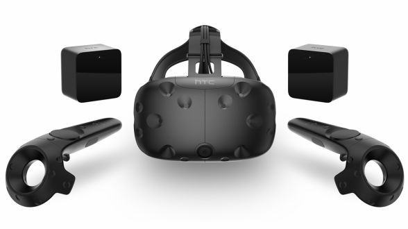

# SteamVR / HTC Vive

## Steam

SteamはアメリカのValve Corporationが開発・運営するゲーム配信プラットフォーム。
app storeやgoogle playなどと同様に

* 購入したゲームの端末間共有
* ゲームのアップロード・インストール・アップデート
* 対戦ゲームのためのプラットフォーム

などの機能を提供する。

## SteamVR / HTC VIVE

### 概要

SteamVRはValveが台湾のHTC Corporationと提携・開発したPCゲーム用VRシステム。
HTC VIVEはSteamVR向けに提供されているデバイスの名前である。

（出典：[http://ascii.jp/elem/000/001/147/1147736/](http://ascii.jp/elem/000/001/147/1147736/)）

セットで購入すると

* ヘッドマウントディスプレイ
* ベースステーション x 2
* コントローラー x 2

が付属している。

またオプションでVRトラッカーを購入できる。
これはリストバンドやモデルガンなどに固定することで任意のオブジェクトをトラッキングすることができる。

（出典：[https://www.vive.com/jp/vive-tracker-for-developer/](https://www.vive.com/jp/vive-tracker-for-developer/)）

### 仕組み

Outside-In型のトラッキングを行なっている。

ベースステーション2台が赤外線平面を順に上下方向・左右方向に走査させ、トラッキング対象がそれを受信する。

具体的には

* 同期信号 x 2 ($$0\mu s$$, $$400\mu s$$)
* 走査 ($$1222–6777\mu s$$)

をベースステーション2台×縦横の4回を1サイクルとして行なっているらしい（参考：[https://github.com/ashtuchkin/vive-diy-position-sensor](https://github.com/ashtuchkin/vive-diy-position-sensor)）。

赤外線平面は一定の角速度で走査されるため、同期信号から走査の受信までの時間から位置を推定できる。

VIVEのHMDは内部に32個の赤外線受光素子が埋め込まれている。

### SteamVR Tracking HDK

[https://www.triadsemi.com/product/steamvr-tracking-hdk/](https://www.triadsemi.com/product/steamvr-tracking-hdk/)

トラッキング対象となるオブジェクトを作成するための開発キット。
基板を自作オブジェクトの中に仕込むことでVRトラッカーを自作できる。

