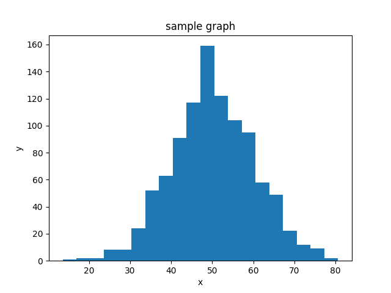

# matplotlib template

## 2次元

### 折れ線

```py
import matplotlib.pyplot as plt
import numpy as np

xs = np.arange(0.1, 10, 0.5)
ys = 1 / xs

plt.plot(xs, ys, c='blue', label='$y=\\frac{1}{x}$')

plt.title('sample graph')
plt.xlabel('x')
plt.ylabel('y')
plt.legend()

plt.show()

```


### 散布図

```py
import matplotlib.pyplot as plt
import numpy as np

rx = np.random.rand(50)
ry = np.random.rand(50)
plt.scatter(rx, ry, c='red', label='group1')

bx = np.random.rand(50)
by = np.random.rand(50)
plt.scatter(bx, by, c='blue', label='group2')

plt.title('sample graph')
plt.xlabel('x')
plt.ylabel('y')
plt.legend(loc='upper right')

plt.show()

```


### ヒストグラム

```py
import matplotlib.pyplot as plt
import numpy as np

# 平均 50, 標準偏差 10 の正規乱数を1,000件生成
xs = np.random.normal(50, 10, 1000)
plt.hist(xs, bins=20)

plt.title('sample graph')
plt.xlabel('x')
plt.ylabel('y')

plt.show()

```



## 3次元

### ワイヤーフレーム/サーフェース

```py
from mpl_toolkits.mplot3d import Axes3D
import matplotlib.pyplot as plt
import numpy as np

def func(x, y):
    return x**2+y**2

x = np.arange(-10, 10, 0.1)
y = np.arange(-10, 10, 0.1)
X, Y = np.meshgrid(x, y)
Z = func(X, Y)

fig = plt.figure()
ax = Axes3D(fig)
ax.plot_wireframe(X,Y,Z)
#ax.plot_surface(X,Y,Z)
plt.show()

```


