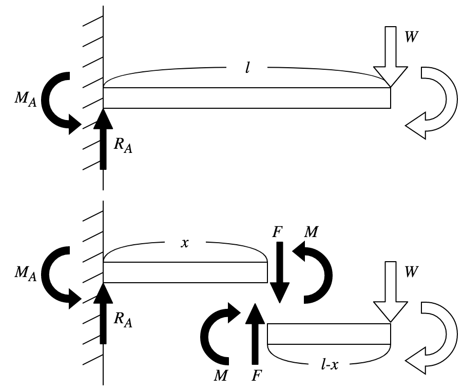
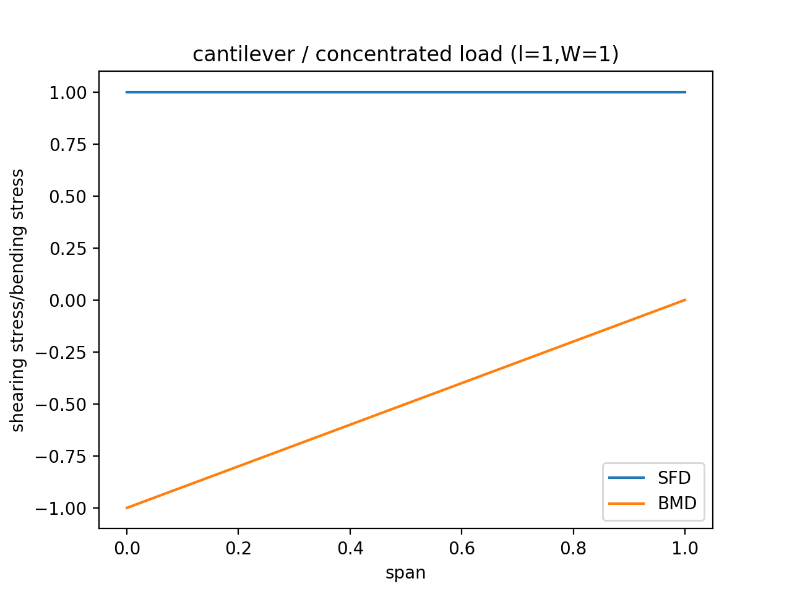
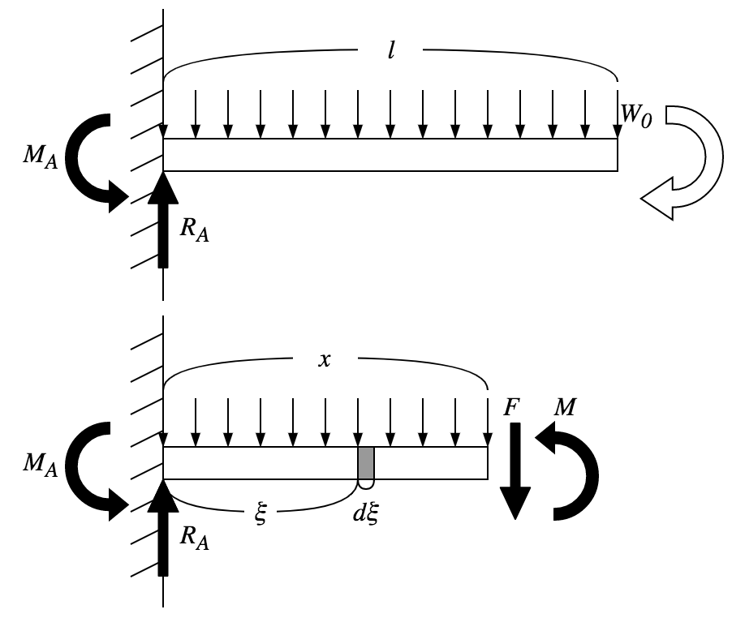
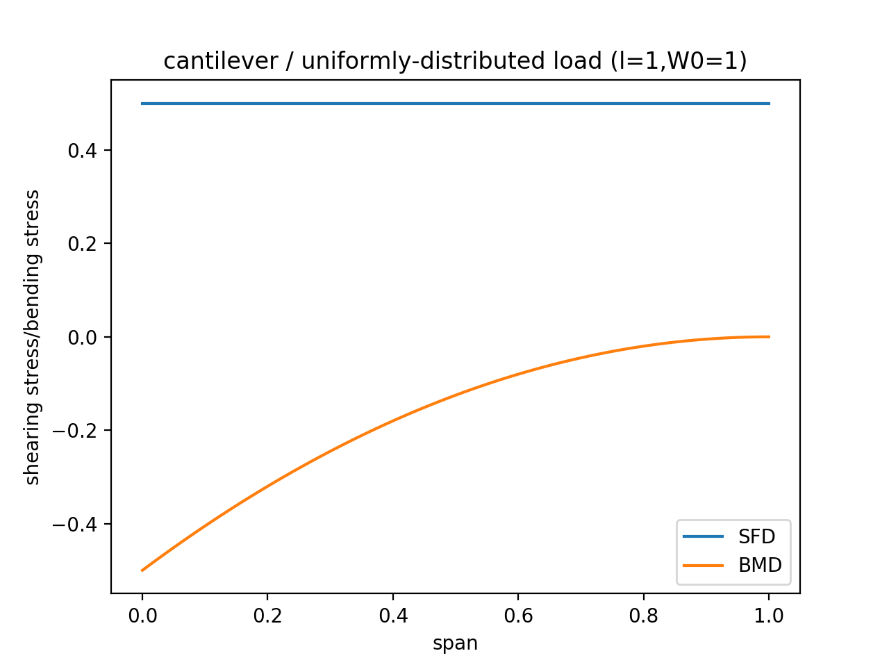
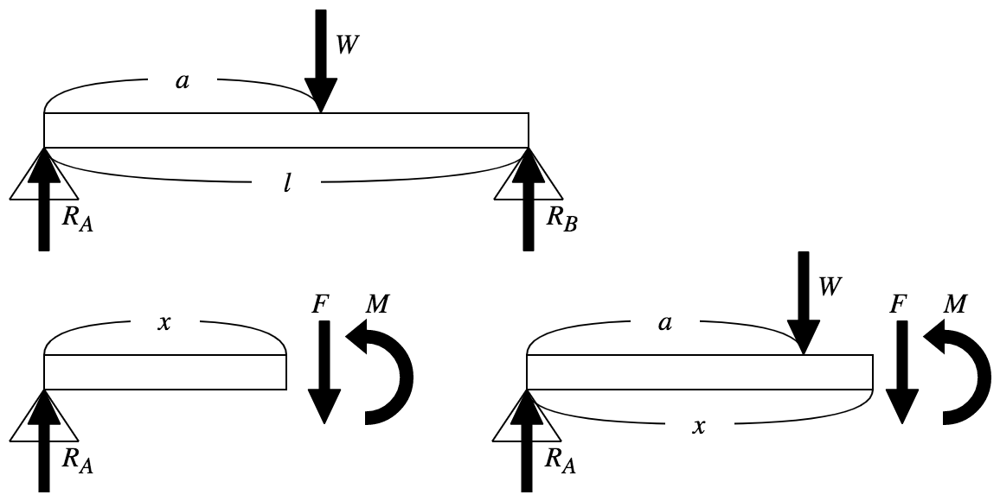
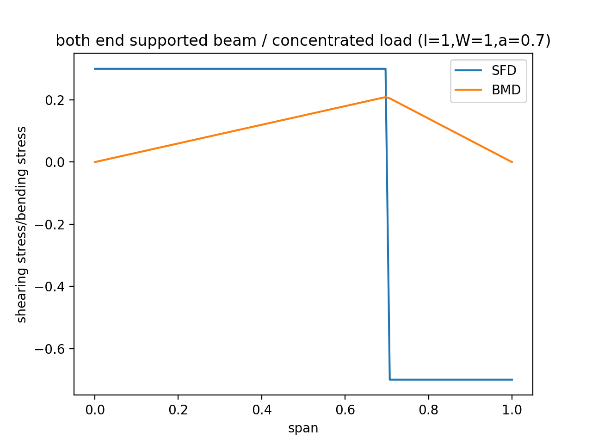
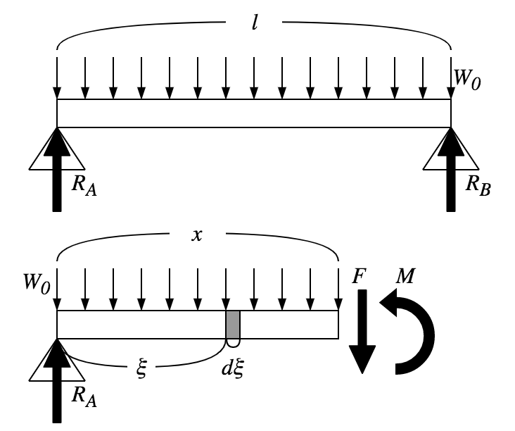
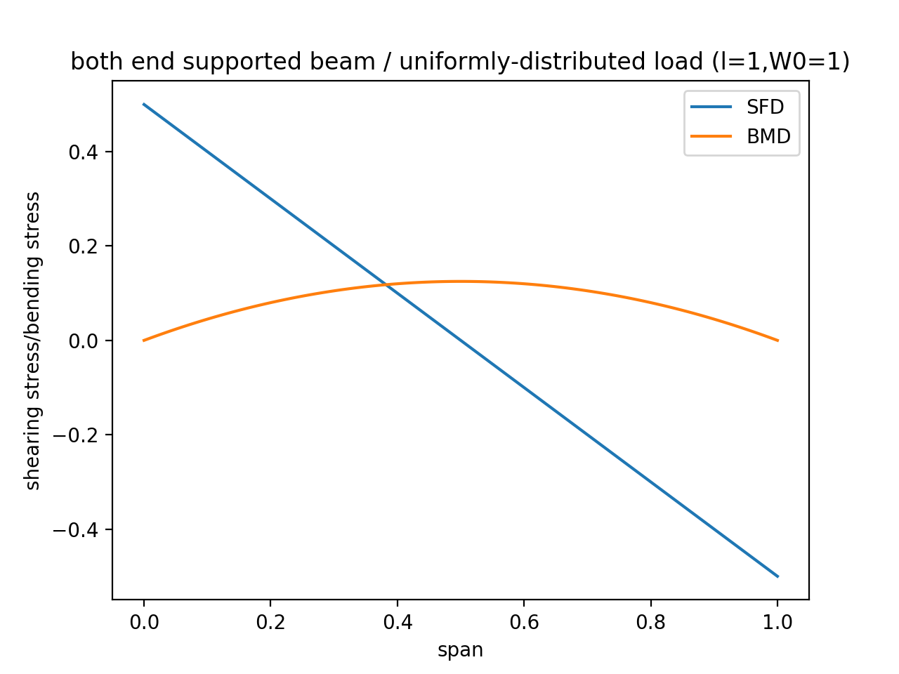

# 単純な梁の弾性応力解析

支持されている梁に荷重を加えたとき、変形量が微小であるものとして、梁の内部に働く応力について考える。

## 片持ち梁（集中荷重）

一方の端を固定支持した長さ $$l$$ の梁の反対側の端に $$W$$ の集中荷重を加える。



まず全体の釣り合いの式を考える。

$$\begin{cases}
R_A - W = 0 \\
M_A - Wl = 0
\end{cases}$$

次に位置 $$x$$ の仮想断面における釣り合いの式を考える。
切断法では断面の左右どちらかに着目して釣り合いの式を考えればその断面における応力が求まることが知られているため、左側についてだけ考える。

$$\begin{cases}
R_A - F = 0 \\
M_A - Fx + M = 0
\end{cases}$$

これらを解くと

$$\begin{cases}
F = W \\
M = -W(l-x)
\end{cases}$$

を得る。
これに基づいてSFD、BMDを描くと以下のようになる。



## 片持ち梁（等分布荷重）

長さ $$l$$ の片持ち梁全体に等分布荷重 $$W_0$$ を加える（なお分布荷重の値は単位長さあたりの大きさを表す）。



まず全体の釣り合いの式を考える。

$$\begin{cases}
R_A - \int_0^l W_0 d\xi = 0 \\
M_A - \int_0^l \xi \cdot W_0 d\xi = 0
\end{cases}$$

次に位置 $$x$$ の仮想断面における釣り合いの式を考える。

$$\begin{cases}
R_A - \int_0^x W_0 d \xi - F = 0 \\
M_A - \int_0^x \xi \cdot W_0 d\xi - Fx + M = 0
\end{cases}$$

これらを解くと

$$\begin{cases}
R_A = \frac{W_0l}{2} \\
M = - \frac{W_0}{2}(l-x)^2
\end{cases}$$

を得る。
これに基づいてSFD、BMDを描くと以下のようになる。



## 両端支持梁（集中荷重）

長さ $$l$$ の両端支持梁の一端から $$a$$ の位置に集中荷重 $$W$$ を加える。



まず全体の釣り合いの式を考える。

$$\begin{cases}
R_A + R_B - W = 0 \\
-0 \cdot R_A + Wa - R_Bl = 0
\end{cases}$$

次に位置 $$x$$ の仮想断面における釣り合いの式を考える。
$$x$$ が $$W$$ を超えているかによって場合分けが必要になる。

$$x < a$$ のとき

$$\begin{cases}
R_A - F = 0 \\
-0 \cdot R_A + Fx - M = 0
\end{cases}$$

$$x > a$$ のとき

$$\begin{cases}
R_A - W - F = 0 \\
-0 \cdot R_A + Wa + Fx - M = 0
\end{cases}$$

これらを解くと

$$\begin{cases}
R_A = \frac{l-a}{l}W \\
R_B = \frac{a}{l}W \\
F = \begin{cases}\frac{l-a}{l}W & (x < a) \\ - \frac{a}{l}W & (x > a) \end{cases}\\
M = \begin{cases}\frac{l-a}{l}Wx & (x < a) \\ \frac{l-x}{l}aW & (x > a) \end{cases}
\end{cases}$$

を得る。
これに基づいてSFD、BMDを描くと以下のようになる。



## 両端支持梁（分布荷重）

長さ $$l$$ の両端支持梁へ分布荷重 $$W_0$$ を加える。



まず全体の釣り合いの式を考える。

$$\begin{cases}
R_A + R_B - \int_0^l W_0d\xi = 0 \\
-0 \cdot R_A + \int_0^l \xi \cdot W_0 d\xi - R_Bl = 0
\end{cases}$$

次に位置 $$x$$ の仮想断面における釣り合いの式を考える。

$$\begin{cases}
R_A - \int_0^x W_0 d\xi - F = 0 \\
-0 \cdot R_A + \int_0^x \xi \cdot W_0 d\xi + Fx - M = 0
\end{cases}$$

これを解くと

$$\begin{cases}
F = \frac{W_0}{2}(l-2x) \\
M = \frac{W_0}{2}(l-x)x
\end{cases}$$

を得る。



## ソースコード

```py
import matplotlib.pyplot as plt
import numpy as np

xs = np.linspace(0, 1, 100)
sfs = list(map(lambda x: 1, xs))
bms = -1 * (1 - xs)

plt.plot(xs, sfs, label='SFD')
plt.plot(xs, bms, label='BMD')

plt.title('cantilever / concentrated load (l=1,W=1)')
plt.xlabel('span')
plt.ylabel('shearing stress/bending stress')
plt.legend()

plt.show()

```

```py
import matplotlib.pyplot as plt
import numpy as np

xs = np.linspace(0, 1, 100)
sfs = list(map(lambda x: 1/2, xs))
bms = -1/2 * np.power(1 - xs, 2)

plt.plot(xs, sfs, label='SFD')
plt.plot(xs, bms, label='BMD')

plt.title('cantilever / uniformly-distributed load (l=1,W0=1)')
plt.xlabel('span')
plt.ylabel('shearing stress/bending stress')
plt.legend()

plt.show()

```

```py
import matplotlib.pyplot as plt
import numpy as np

l = 1
a = 0.7
w = 1

xs = np.linspace(0, l, 100)

def sf_func(x):
  if x < a:
    return (l-a)*w/l
  else:
    return -a*w/l

def bm_func(x):
  if x < a:
    return (l-a)*w*x/l
  else:
    return (l-x)*a*w/l

sfs = list(map(sf_func, xs))
bms = list(map(bm_func, xs))

plt.plot(xs, sfs, label='SFD')
plt.plot(xs, bms, label='BMD')

plt.title('both end supported beam / concentrated load (l=1,W=1,a=0.7)')
plt.xlabel('span')
plt.ylabel('shearing stress/bending stress')
plt.legend()

plt.show()

```

```py
import matplotlib.pyplot as plt
import numpy as np

l = 1
w0 = 1

xs = np.linspace(0, l, 100)

sfs = w0*(l-2*xs)/2
bms = w0*(l-xs)*xs/2

plt.plot(xs, sfs, label='SFD')
plt.plot(xs, bms, label='BMD')

plt.title('both end supported beam / uniformly-distributed load (l=1,W0=1)')
plt.xlabel('span')
plt.ylabel('shearing stress/bending stress')
plt.legend()

plt.show()

```
