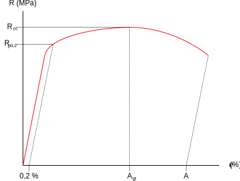
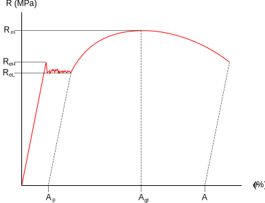

# 変形特性（deformation property）

ある材料に加えた荷重と変形の関係を**変形特性**という。

## 応力-ひずみ線図（stress-strain diagram）

材料の変形特性を断面積や長さについて正規化して記述した図。

グラフと材料の変形特性の関係は次のように説明できる。

1. **比例限度（proportional limit）**までは除荷すると変形が完全に元に戻る（弾性変形）
    * 応力とひずみが比例関係になる
2. **弾性限度（elastic limit）**に達すると変形が残るようになる（塑性変形）
    * **上降伏点（upper yield stress）**を超えると応力が減少し応力一定（**下降伏点（lower yield stress）**・**降伏応力**）のままひずみが増加する区間がある
    * 一度降伏点を超える応力を加えると再び応力に応じてひずみが増減するようになるが、常に図中の $$A_p$$ で表される**塑性ひずみ（plastic strain）**・**永久ひずみ（permanent strain）**が残るようになる（これの減少**加工硬化（work hardening）**・**ひずみ硬化（strain hardening）**という）
    * 降伏点を超えた後に荷重を加えることを**再負荷（reloading）**という
3. さらに負荷を加えると**極限強さ（ultimate strength）**に達する
    * 極限強さを超えると材料が部分的に細くなり応力を小さくしてもひずみが大きくなり（材料が伸び）、最終的に千切れる
    * グラフ上ではあくまで部材に加える力を標準状態の面積で割ったものを応力とするが、細くなった部分は面積が小さくなるため局所的な応力は増加している（これを**真応力**と呼んで区別する）

なお、非鉄金属や非金属などの材料のように降伏点を持たないものもある。

### 降伏点がない例

### 降伏点がある例

（出典：https://ja.wikipedia.org/wiki/%E5%BF%9C%E5%8A%9B-%E3%81%B2%E3%81%9A%E3%81%BF%E6%9B%B2%E7%B7%9A）
