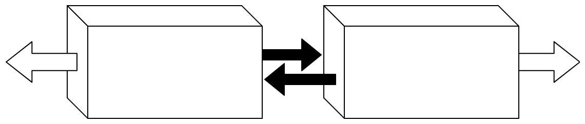
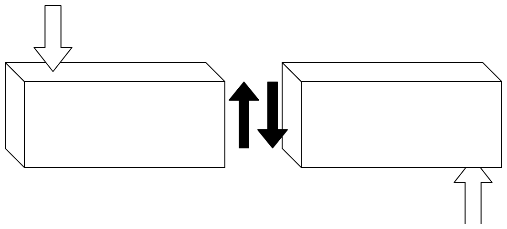
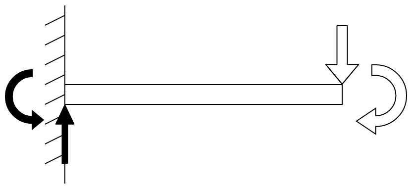
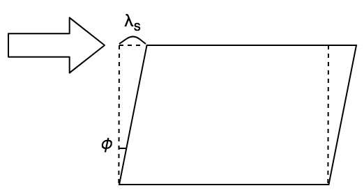

# 応力（stress）

物体が外力を受けて変形しているとき、物体の内部には外力に釣り合う**内力（internal force）**が生じているものと考えられる。
この内力が外力と釣り合うことができなければ物体は破壊されると考えて良い。

このときの単位面積あたりの内力の大きさを**応力**といい、$$[\mathrm{N/mm^2}]$$ 、$$[\mathrm{MPa}]$$ などの単位で表す（数値が大きくなることが多いため）。

応力は次の2種類に分類される。

## 垂直応力（normal stress）

物体上にある仮想断面（作用面）を定義するとき、作用面の垂直方向に働く力を**軸力**、応力を**垂直応力**という。

## せん断応力（shearing stress）

物体上にある仮想断面（作用面）を定義するとき、作用面と平行な方向に働く力を**せん断力**、応力を**せん断応力**という。

## 曲げ応力（bending stress）

長さ $$l$$ の梁の一端を固定支持し、反対側にせん断方向の外力によって生じるモーメントを**曲げモーメント（bending moment）**といい、これと対応して生じる応力を**曲げ応力**という。
曲げ応力は不均一な垂直応力と捉えることができ、またせん断力に付随して生じるものであるため、ほかの2つと密接な関係がある。

# ひずみ（strain）

材料力学では物体の変形を一般化して考えるため、変形量を変形前の長さで割ったものを指標とする。
これを**ひずみ**という。

ひずみは次の2種類に大別される。

## 垂直ひずみ（normal strain）

長さ $$l_0$$ 幅 $$d_0$$ の物体に軸力が作用して長さ $$l$$ 幅 $$d$$ に変形したとき、$$\varepsilon = \frac{l-l_0}{l_0}$$ で表される値を**垂直ひずみ**または**縦ひずみ（longitudinal strain）**といい、$$\varepsilon' = \frac{d-d_0}{d_0}$$ で表される値を**横ひずみ（lateral strain）**という。

### ポアソン比（Poisson's ratio）

垂直ひずみと横ひずみの比は材料に固有であることが知られており、$$\nu = - \frac{\varepsilon'}{\varepsilon}$$ を**ポアソン比**と呼ぶ。

## せん断ひずみ（shearing strain）

高さ $$l$$ の物体にせん断力が作用して下図のように平行四辺形に変形したとき、上面の横方向の変位を $$\lambda_s$$ として $$\gamma = \frac{\lambda_s}{l} = \tan \phi \simeq \phi$$ で表される値を**せん断ひずみ**という。

