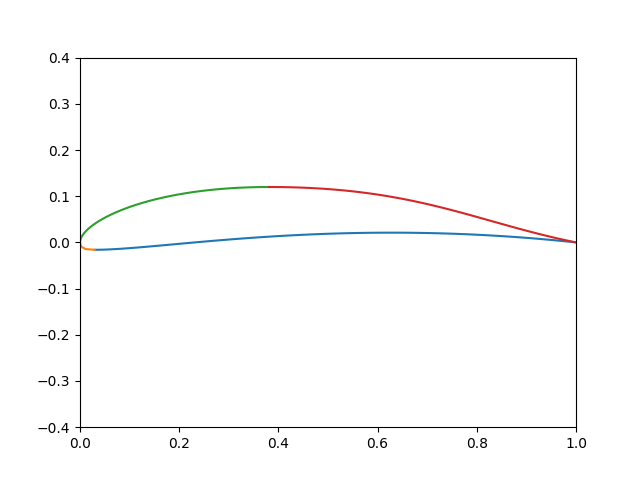

# 翼型のベジェ曲線表現

翼型の外形を4つの3次ベジェ曲線で表現する方法に言及する。



```py
import matplotlib.pyplot as plt
import numpy as np

def bezier3(p0, p1, p2, p3, n):
    ts = [i/n for i in range(n)]
    ts.append(1)
    def f(t):
        a0 = (1-t)**3
        a1 = 3 * (1-t)**2 * t
        a2 = 3 * (1-t)* t**2
        a3 = t**3
        return (
            a0*p0[0] + a1*p1[0] + a2*p2[0] + a3*p3[0],
            a0*p0[1] + a1*p1[1] + a2*p2[1] + a3*p3[1]
        )
    return map(f, ts)

# 上端・下端の(y1, x2, x1, x3)
upper = (0.11991, 0.13077, 0.38109, 0.67725)
lower = (-0.015984, 0.0063793, 0.029729, 0.17167)
# 前縁下側、前縁上側のコントロールポイント(y1,y2)
front = (-0.011888, 0.041121)
# 後縁下側、後縁上側のコントロールポイント(x1,y1,x2,y2)
rear = (0.51552, 0.055408, 0.79526, 0.044435)

# 点数の割り振り
n = 160
part1 = abs(lower[0]) + 1 - lower[2]
part2 = abs(lower[0]) + lower[2]
part3 = abs(upper[0]) + upper[2]
part4 = abs(upper[0]) + 1 - upper[2]
total = part1 + part2 + part3 + part4

# 後縁下側
ps = list(bezier3(
            (lower[2], lower[0]), (lower[3], lower[0]),
            (rear[0], rear[1]), (1, 0),
            int(n * part1 / total)))
xs = list(map(lambda p: p[0], ps))
ys = list(map(lambda p: p[1], ps))
plt.plot(xs, ys)

# 前縁下側
ps = list(bezier3(
            (0, 0), (0, front[0]),
            (lower[1], lower[0]), (lower[2], lower[0]),
            int(n * part2 / total)))
xs = list(map(lambda p: p[0], ps))
ys = list(map(lambda p: p[1], ps))
plt.plot(xs, ys)

# 前縁上側
ps = list(bezier3(
            (0, 0), (0, front[1]),
            (upper[1], upper[0]), (upper[2], upper[0]),
            int(n * part3 / total)))
xs = list(map(lambda p: p[0], ps))
ys = list(map(lambda p: p[1], ps))
plt.plot(xs, ys)

# 後縁上側
ps = list(bezier3(
            (upper[2], upper[0]), (upper[3], upper[0]),
            (rear[2], rear[3]), (1, 0),
            int(n * part4 / total)))
xs = list(map(lambda p: p[0], ps))
ys = list(map(lambda p: p[1], ps))
plt.plot(xs, ys)


plt.xlim(0, 1)
plt.ylim(-0.4, 0.4)
plt.show()

```