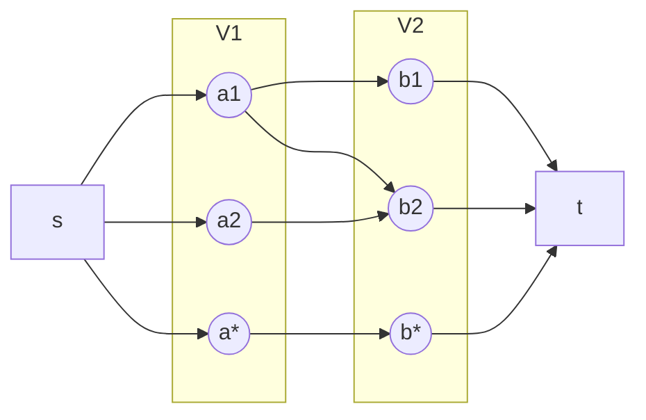

# 2部グラフのマッチング問題

## 定義

2部グラフ $$G = (V_1, V_2; E)$$ が与えられたとき、要素数の最大のマッチングを求める問題を**2部グラフのマッチング問題**という。
2部グラフのマッチング問題は下図のように始点 $$s$$ と終点 $$t$$ を付け加え、すべての辺の容量を1としたグラフ $$\tilde{G}$$ の最大流問題に帰着できる。

Dinitzの増加路法を利用することで、最悪時間計算量は $$O(\sqrt{n}m)$$ になる。

## ケーニヒの定理（Kőnig theorem）

最大マッチング問題の双対問題である最小頂点被覆問題を利用した方法。

>頂点被覆（vertex cover）

>部分集合 $$W \subset V$$ が**頂点被覆**であるとは頂点の

>$$
^\forall e \in E \ (\partial^+ e \in W \vee \partial^- e \in W)
$$

>を満たすこと、すなわちすべての辺が $$W$$ 中の頂点のどれかとつながっていることをいう。

>任意のマッチング $$M \subset E$$ と任意の頂点被覆 $$W \subset V$$ の間には

>$$
|M| \leq |W|
$$

>の関係が成立する。

ケーニヒの定理によると次の性質が成立する。

2部グラフにおける最大マッチングの辺数は最小頂点被覆の頂点数に等しくなる

 
