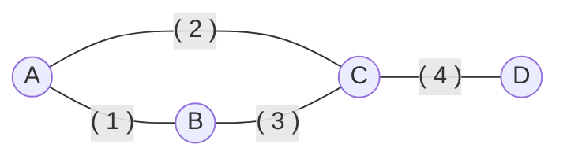
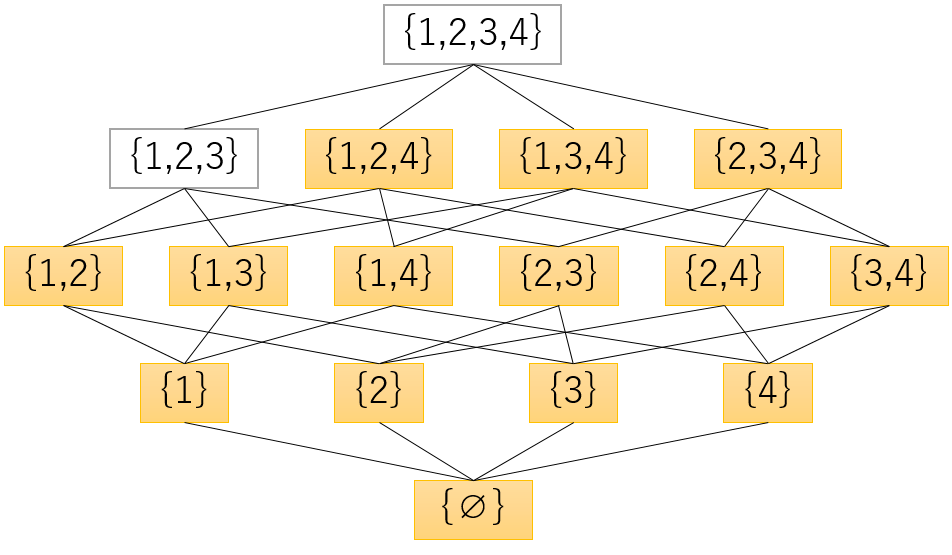

# グラフとマトロイド

グラフとマトロイドの関係について言及する。

## グラフ的マトロイド（graphic matroid）

無向グラフ $$G = (V,E)$$ を考える。
枝集合の部分集合のうち閉路を含まないものの集合を $$\mathcal{I} \subset 2^E$$ とすると、$$\mathbf{M}(G) = (E,\mathcal{I})$$ はマトロイドになり、これを**グラフ的マトロイド**という。

### 例

* $$V = \{A,B,C,D\}$$
* $$E = \{1,2,3,4\}$$

* 基族：$$\mathcal{B} = \{\ \{1,2,4\},\{1,3,4\},\{2,3,4\}\ \}$$
  * 全域木に相当する
* サーキット：$$\mathcal{C} = \{\ \{1,2,3\}\ \}$$
  * 閉路に相当する
* 基本サーキットの例
  * $$C(\{1,2,4\}|3) = \{1,2,3\}$$
  * $$C(\{1,3,4\}|2) = \{1,2,3\}$$
  * $$C(\{1,2\}|3) = \{1,2,3\}$$
* 双対マトロイドの基族：$$\mathcal{B}^* = \{\ \{1\},\{2\},\{3\}\}\ \}$$
* コサーキット：$$\mathcal{C}^* = \{\ \{1,2\},\{1,3\},\{2,3\},\{4\}\ \}$$
  * カットセットに相当する

（書きかけ）

## 横断マトロイド（transversal matroid）

2部グラフ $$G=(V_1, V_2; E)$$ を考える。
一方の点集合 $$V_1$$ のうちマッチングの端点になり得るもの全体を $$\mathcal{I} \subset 2^{V_1}$$ とすると、$$\mathbf{M}(G) = (V_1, \mathcal{I})$$ はマトロイドになり、これを**横断マトロイド**という。
