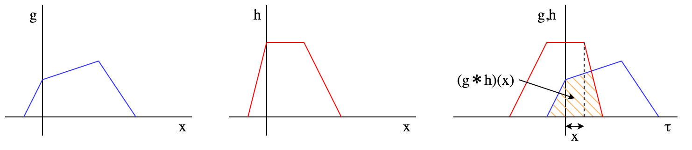

# 畳み込み

## 定義

次の式で定義される $$(g*h)(x)$$ を関数 $$g,h$$ の畳み込みという。

$$\begin{eqnarray}
(g*h)(x) &=& \int_{-\infty}^\infty g(\tau)h(x-\tau)\tau \\
c_k &=& \sum_{l=-\infty}^\infty a_l b_{k-l}
\end{eqnarray}$$

関数 $$f,g$$ ないし数列 $$a,b$$ の一方を反転・並行移動させて重ね合わせ、その面積を計算したものに相当する。

## 応用

### 多項式の積

畳み込み演算の出現する構造の例として多項式の積がある。
このような多項式の積は多倍長整数の乗算などに利用される。

$$\begin{eqnarray}
&&(a_{N-1}x^{N-1}+\cdots+a_1x+a_0)(b_{M-1}x^{M-1}+\cdots+b_1x+b_0) \\
&=& \sum_{k=0}^{N-1} \sum_{l=0}^{M-1}a_kb_l x^{k+l} \\
&=& \sum_{k=0}^{N+M-2} \left( \sum_{l=0}^k a_l b_{k-l} \right) x^k \\
&=& \sum_{k=0}^{N+M-2} c_k x^k
\end{eqnarray}$$

### 相関関数との関係

似た概念として相関関数がある。
相関関数の場合は反転を行わずに複素共役を取り平行移動・重ね合わせを行う。

$$\begin{eqnarray}
r_{xy}(\tau) = \int_{-\infty}^\infty x(t)\bar{y}(t-\tau)dt
\end{eqnarray}$$
