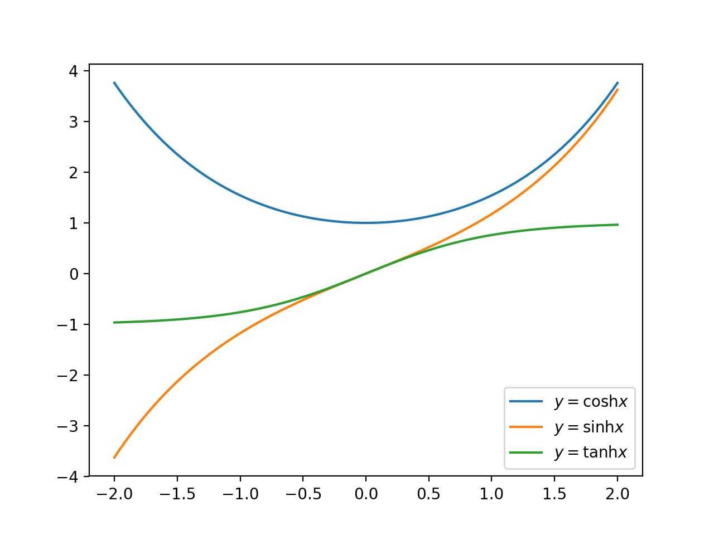

# 双曲線関数（hyperbolic）

## 定義

次のように定義される関数を**双曲線関数**という。

$$
\begin{eqnarray}
\sinh x&=&\frac{e^x-e^{-x}}{2}\\
\cosh x&=&\frac{e^x+e^{-x}}{2}\\
\tanh x&=&\frac{\sinh x}{\cosh x}=\frac{e^x-e^{-x}}{e^x+e^{-x}}
\end{eqnarray}
$$



## 性質

相互関係

* $$\cosh^2 x - \sinh^2 x = 1$$

微分

* $$(\sinh x)' = \cosh x$$
* $$(\cosh x)' = \sinh x$$
* $$(\tanh x)' = \frac{1}{\cosh^2 x}$$

積分

* $$\int \sinh x dx = \cosh + C$$
* $$\int \cosh x dx = \sinh + C$$

加法定理

* $$\sinh (\alpha \pm \beta) = \sinh \alpha \cosh \beta \pm \cosh \alpha \sinh \beta$$
* $$\cosh (\alpha \pm \beta) = \cosh \alpha \sinh \beta \pm \sinh \alpha \cosh \beta$$
* $$\tanh (\alpha \pm \beta) = \frac{\tanh \alpha \pm \tanh \beta}{1 \pm \tanh \alpha \tanh \beta}$$

逆関数

* $$x = \sinh y$$　⇔　$$y = \log(x + \sqrt{x^2+1})$$
* $$x = \cosh y$$　⇔　$$y = \log(x \pm \sqrt{x^2-1})$$

## 積分への応用

$$\sqrt{a^2+x^2}$$ の形を含む積分は双曲線関数を利用した部分積分を用いることで計算できることが多い。

$$\int \sqrt{a^2+x^2}dx$$ を解く。
$$x = a\sinh t$$ とすると、

$$
\begin{eqnarray}
\int \sqrt{a^2+x^2}dx &=& a^2 \int \cosh t \cdot \cosh t dt = a^2 \int \cosh^2 t dt \\
&=& \frac{a^2}{2} \int (1+\cosh 2t) dt \\
&=& \frac{a^2}{2} (t + \frac{1}{2}\sinh 2t) + C \\
&=& \frac{a^2}{2} (t + \sinh t\cosh t) + C \\
&=& \frac{a^2}{2} \sinh^{-1} \frac{x}{a} + \frac{x}{2}\sqrt{a^2+x^2} + C \\
&=& \frac{1}{2} \left\{a^2 \log\left(x+\sqrt{a^2+x^2}\right)+x\sqrt{a^2+x^2} \right\} + C
\end{eqnarray}
$$

同じく $$\int \frac{1}{\sqrt{a^2 + x^2}} dx$$ も $$x = a\sinh t$$ とすると、

$$
\begin{eqnarray}
\int \frac{1}{\sqrt{a^2 + x^2}} dx &=& \int \frac{1}{a \cosh t} a \cosh t dt \\
&=& t + C \\
&=& \log\left(\frac{x}{a} + \sqrt{\frac{x^2}{a^2}+1}\right)  + C \\
&=& \log\left(x + \sqrt{a^2+x^2}\right) + C'
\end{eqnarray}
$$

## ソースコード

```py
import numpy as np
import matplotlib.pyplot as plt

x = np.linspace(-2,2,200)
cosh = np.cosh(x)
sinh = np.sinh(x)
tanh = np.tanh(x)

plt.plot(x, cosh, label='$y=\\cosh x$')
plt.plot(x, sinh, label='$y=\\sinh x$')
plt.plot(x, tanh, label='$y=\\tanh x$')

plt.legend()

plt.show()

```
