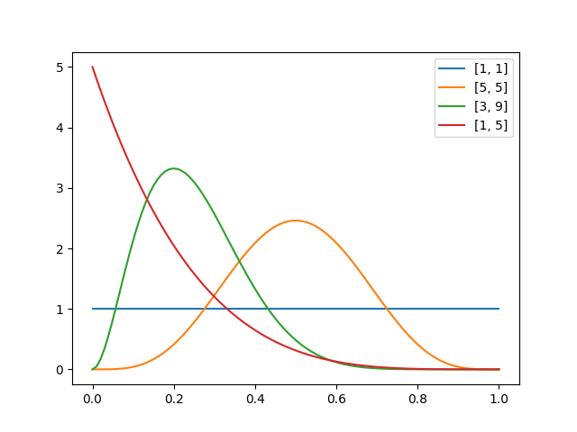

# 確率分布（probability distribution）

## 概要

||||||
|----|----|----|----|----|
||||||
||||||

## ベルヌーイ分布（Bernoulli distribution）

確率変数$$x$$($$x \in \{0,1\}$$)が確率$$\mu$$で1の値を取るときの確率分布。
つまり二項分布の$$n=1$$のケースに相当する。

$$
Bern(x|\mu) = \mu^x(1-\mu)^{1-x} \\
x \in \{0,1\}
$$

## 第1種ベータ分布（beta distribution）

ベルヌーイ分布の共役事前分布である。

$$
Beta(\mu|a,b) = \frac{x^{a-1}(1-x)^{b-1}}{\int_0^1 x^{a-1}(1-x)^{b-1}dx} \\
x \in [0,1], \ \ \ a>0, \ \ \ b>0
$$



```py
import numpy as np
import scipy.stats
import matplotlib.pyplot as plt

params = [[1,1],[5,5],[3,9],[1,5]]

x = np.linspace(0,1,101)
for p in params:
    rv = scipy.stats.beta(p[0],p[1])
    y = rv.pdf(x)
    plt.plot(x,y,label=p)

plt.legend()
plt.show()

```
