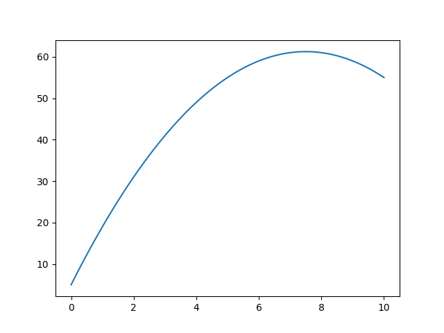

# 有限要素法の数値計算例

## 1次元

$$
\begin{eqnarray}
\frac{d^2u}{dx^2}-\lambda = 0 \ \ \ (0 \leq x \leq L) \tag{1} \\
u | _ {x=0}=a, \ \ \  \frac{du}{dx} | _ {x=L} = b
\end{eqnarray}
$$

※式を展開して解いていったときの結論と一致が確認できていないので



```py
import numpy as np
import matplotlib.pyplot as plt

l = 10
lam = -2
a = 5
b = -5

n = 100 #小区間を100個
ps = np.linspace(0, l, n+1) #区分点は101個

#各小区間の長さ
lens = []
for i in range(n):
    lens.append(ps[i+1]-ps[i])

A = np.zeros((n+1,n+1))
B = np.zeros((n+1,1))

for i in range(n):
    val = 1 / lens[i]
    A[i][i] += val
    A[i][i+1] += -val
    A[i+1][i] += -val
    A[i+1][i+1] += val
    val2 = lam * lens[i] / 2
    B[i][0] += val2 + b
    B[i+1][0] += val2 - b

A[0] = np.zeros((1,n+1))
A[0][0] = 1
B[0][0] = -a

res = -np.linalg.solve(A,B)

plt.plot(ps, res)
plt.show()

```
